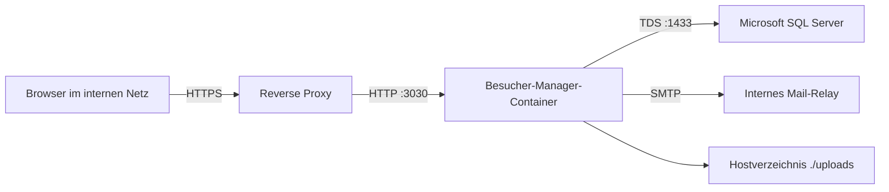

# Deployment-Handbuch

Dieses Dokument beschreibt die Installation, Konfiguration, Inbetriebnahme, Aktualisierung und Wiederherstellung des Besucher Managers auf einem Linux-Server mit Docker Compose.

> [!CAUTION]
> Die Migration `023_remove_approvals_add_nationality.sql` ist destruktiv. Sie entfernt frühere Genehmigungsspalten und zugehörige Laufzeitdaten. Vor dem Deployment muss ein erfolgreich erstelltes und überprüftes SQL-Backup vorliegen.

## Inhaltsverzeichnis

- [Zielbild](#zielbild)
- [Voraussetzungen](#voraussetzungen)
- [Deploymentvarianten](#deploymentvarianten)
- [Server vorbereiten](#server-vorbereiten)
- [Umgebungsvariablen](#umgebungsvariablen)
- [Datenbank vorbereiten](#datenbank-vorbereiten)
- [SMTP-Relay konfigurieren](#smtp-relay-konfigurieren)
- [Erstdeployment](#erstdeployment)
- [Reverse Proxy und HTTPS](#reverse-proxy-und-https)
- [Abnahme nach dem Start](#abnahme-nach-dem-start)
- [Updates](#updates)
- [Backup und Wiederherstellung](#backup-und-wiederherstellung)
- [Rollback](#rollback)
- [Betrieb](#betrieb)
- [Fehleranalyse](#fehleranalyse)
- [Deployment-Checkliste](#deployment-checkliste)

## Zielbild



Empfohlene Eigenschaften:

- HTTPS-Terminierung am Reverse Proxy
- App-Port `3030` nur intern erreichbar
- SQL Server nicht öffentlich erreichbar
- persistentes, gesichertes Hostverzeichnis `./uploads`
- regelmäßige SQL-Backups außerhalb des Containers
- lokale `.env` und SMTP-YAML ohne Git-Tracking

## Voraussetzungen

### Server

- Linux mit systemd
- Docker Engine
- Docker Compose Plugin
- Git
- mindestens 4 GB RAM; bei lokalem SQL Server mehr einplanen
- ausreichend Speicher für Images, Uploads und Backups
- DNS-Eintrag für die produktive URL
- TLS-Zertifikat am Reverse Proxy

### Prüfung

```bash
docker version
docker compose version
git --version
df -h
```

### Netzwerk

Erforderliche Verbindungen:

| Quelle | Ziel | Port | Zweck |
|---|---|---:|---|
| Reverse Proxy | App | 3030/TCP | HTTP-Upstream |
| App | SQL Server | 1433/TCP | Datenbank |
| App | SMTP-Relay | abhängig vom Relay | E-Mail |
| Administrator | Git-/Registry-Ziele | 443/TCP | Pull und Build |

## Deploymentvarianten

### Variante A: Externer SQL Server

Empfohlen für bestehende oder zentral administrierte SQL-Infrastruktur.

- Nur der Service `app` wird gestartet.
- `MSSQL_HOST` verweist auf den externen SQL Server.
- Datenbank, Login und Berechtigungen werden vorab administrativ eingerichtet.
- Das mitgelieferte Backupskript ist für diese Variante nicht automatisch geeignet; das zentrale SQL-Backupverfahren verwenden.

### Variante B: SQL Server im Compose-Profil

Für Test, Entwicklung oder eigenständig betriebene Installationen:

```bash
docker compose --profile local-db up -d
```

Das Profil startet:

- `sqlserver`
- `db-bootstrap`
- `app`

Persistenz:

- `sqlserver_data:/var/opt/mssql`
- `./uploads:/app/uploads`

## Server vorbereiten

Empfohlener Installationspfad:

```bash
sudo mkdir -p /opt/besucher-manager
sudo chown "$USER":"$USER" /opt/besucher-manager
git clone https://github.com/linuxlearner-germany/Besucher_Manager.git /opt/besucher-manager
cd /opt/besucher-manager
```

Konfigurationsdateien anlegen:

```bash
cp .env.example .env
cp config/mail-relay.yml.example config/mail-relay.yml
chmod 600 .env config/mail-relay.yml
```

Prüfen, dass Secrets nicht von Git erfasst werden:

```bash
git status --short
git check-ignore .env config/mail-relay.yml
```

## Umgebungsvariablen

### Starkes Secret erzeugen

```bash
openssl rand -hex 48
```

Den Wert lokal als `APP_SECRET` speichern.

### Beispiel für externen SQL Server und HTTPS

```env
NODE_ENV=production
APP_HOST=0.0.0.0
PORT=3030

PUBLIC_BASE_URL=https://besucher.example.intern
APP_SECURE_COOKIES=true
APP_TRUST_PROXY=127.0.0.1
APP_SECRET=HIER_EIN_LANGES_ZUFAELLIGES_SECRET

MSSQL_HOST=mssql-server.intern
MSSQL_PORT=1433
MSSQL_DATABASE=BesucherManager
MSSQL_USER=besucher_app
MSSQL_PASSWORD=HIER_DAS_SQL_PASSWORT
MSSQL_ENCRYPT=true
MSSQL_TRUST_SERVER_CERTIFICATE=false

ADMIN_USERNAME=admin
ADMIN_PASSWORD=HIER_EIN_INITIALPASSWORT

UPLOAD_DIR=/app/uploads
MAIL_RELAY_CONFIG_PATH=/app/config/mail-relay.yml

AUDIT_REVERSE_DNS_ENABLED=false
AUDIT_TRUST_REMOTE_USER_HEADER=false
AUDIT_REMOTE_USER_HEADER=x-auth-user
```

### Beispiel für lokalen Compose-SQL-Server

```env
NODE_ENV=production
APP_HOST=0.0.0.0
PORT=3030

PUBLIC_BASE_URL=http://server.intern:3030
APP_SECURE_COOKIES=false
APP_TRUST_PROXY=false
APP_SECRET=HIER_EIN_LANGES_ZUFAELLIGES_SECRET

MSSQL_HOST=sqlserver
MSSQL_PORT=1433
MSSQL_DATABASE=BesucherManager
MSSQL_USER=besucher_app
MSSQL_PASSWORD=HIER_EIN_STARKES_SQL_PASSWORT
MSSQL_ENCRYPT=false
MSSQL_TRUST_SERVER_CERTIFICATE=true

ADMIN_USERNAME=admin
ADMIN_PASSWORD=HIER_EIN_INITIALPASSWORT

UPLOAD_DIR=/app/uploads
MAIL_RELAY_CONFIG_PATH=/app/config/mail-relay.yml
```

> [!IMPORTANT]
> `PUBLIC_BASE_URL` muss aus Sicht der Benutzer erreichbar sein. Der Wert wird für Links in Nationalitätsmeldungen verwendet.

### Hinweise zu Cookies und Proxy-Vertrauen

- Bei HTTPS ist `APP_SECURE_COOKIES=true` erforderlich.
- `APP_TRUST_PROXY` nur aktivieren, wenn ein vertrauenswürdiger Proxy vorgeschaltet ist.
- Eine konkrete IP, ein CIDR oder eine definierte Hop-Anzahl ist sicherer als pauschal `true`.
- Der App-Port darf bei aktiviertem Proxy-Vertrauen nicht ungeschützt aus fremden Netzen erreichbar sein.

### Firmenproxy

Falls Build oder Runtime einen ausgehenden Proxy benötigen:

```env
HTTP_PROXY=http://proxy.intern:3128
HTTPS_PROXY=http://proxy.intern:3128
NO_PROXY=localhost,127.0.0.1,::1,sqlserver,db-bootstrap,app,mssql-server.intern,.intern

http_proxy=http://proxy.intern:3128
https_proxy=http://proxy.intern:3128
no_proxy=localhost,127.0.0.1,::1,sqlserver,db-bootstrap,app,mssql-server.intern,.intern
```

Proxy-Zugangsdaten gehören ausschließlich in lokale Serverkonfigurationen.

## Datenbank vorbereiten

### Externer SQL Server

Beispiel für die Einrichtung durch einen SQL-Administrator:

```sql
CREATE DATABASE [BesucherManager];
GO

CREATE LOGIN [besucher_app]
WITH PASSWORD = 'EIN_STARKES_PASSWORT',
     CHECK_POLICY = ON;
GO

USE [BesucherManager];
GO

CREATE USER [besucher_app] FOR LOGIN [besucher_app];
GO

ALTER ROLE [db_owner] ADD MEMBER [besucher_app];
GO
```

Die Anwendung führt beim Start versionierte DDL-Migrationen aus. Das hierfür verwendete Konto benötigt entsprechende Rechte. Nach Abschluss der Schemaentwicklung kann ein restriktiveres Berechtigungsmodell separat geplant werden.

### Lokaler Compose-SQL-Server

Der Service `db-bootstrap` erstellt Datenbank, Login und Datenbankbenutzer idempotent:

```bash
docker compose --profile local-db up -d sqlserver db-bootstrap
docker compose --profile local-db ps
```

## SMTP-Relay konfigurieren

Datei: `config/mail-relay.yml`

```yaml
mailRelay:
  enabled: true
  host: smtp-relay.intern.example
  port: 587
  secure: false
  username: relay-user
  password: relay-pass
  fromAddress: "Besucher Manager <noreply@example.org>"
```

Hinweise:

- `secure: true` wird typischerweise für implizites TLS verwendet.
- Bei STARTTLS auf Port 587 bleibt `secure` üblicherweise `false`.
- Der Absender muss vom Relay akzeptiert werden.
- Die App benötigt ausgehend Netzwerkzugriff auf den SMTP-Port.
- SiBe-Benutzer benötigen eine E-Mail-Adresse im Benutzerkonto.
- Nach dem Start kann im Admincenter eine Relay- oder Beispielmail gesendet werden.

## Erstdeployment

### Externer SQL Server

```bash
cd /opt/besucher-manager
docker compose build app
docker compose up -d app
```

### Lokaler SQL Server

```bash
cd /opt/besucher-manager
docker compose --profile local-db up -d --build
```

### Startvorgang

Der App-Container:

1. prüft die SQL-Verbindung,
2. führt ausstehende Migrationen transaktional aus,
3. legt den initialen Admin an, falls er noch nicht existiert,
4. startet den HTTP-Server,
5. beantwortet den Healthcheck.

Status:

```bash
docker compose ps
docker compose logs --tail=200 app
curl -fsS http://127.0.0.1:3030/health
```

## Reverse Proxy und HTTPS

### Nginx-Beispiel

```nginx
server {
    listen 80;
    server_name besucher.example.intern;
    return 301 https://$host$request_uri;
}

server {
    listen 443 ssl;
    http2 on;
    server_name besucher.example.intern;

    ssl_certificate     /etc/nginx/tls/besucher.example.intern/fullchain.pem;
    ssl_certificate_key /etc/nginx/tls/besucher.example.intern/privkey.pem;

    client_max_body_size 25m;

    location / {
        proxy_pass http://127.0.0.1:3030;
        proxy_http_version 1.1;

        proxy_set_header Host $host;
        proxy_set_header X-Real-IP $remote_addr;
        proxy_set_header X-Forwarded-For $proxy_add_x_forwarded_for;
        proxy_set_header X-Forwarded-Proto https;
        proxy_set_header X-Forwarded-Host $host;
    }
}
```

Passende App-Konfiguration:

```env
PUBLIC_BASE_URL=https://besucher.example.intern
APP_SECURE_COOKIES=true
APP_TRUST_PROXY=127.0.0.1
```

Konfiguration testen und neu laden:

```bash
sudo nginx -t
sudo systemctl reload nginx
curl -Ik https://besucher.example.intern
curl -fsS https://besucher.example.intern/health
```

### Firewall

Wenn ausschließlich der lokale Reverse Proxy zugreift, sollte Port 3030 nicht extern freigegeben werden. SQL-Port 1433 darf nur für notwendige Hosts erreichbar sein.

## Abnahme nach dem Start

### Technische Prüfung

```bash
docker compose ps
curl -fsS http://127.0.0.1:3030/health
curl -fsS http://127.0.0.1:3030/api/health
docker compose logs --tail=200 app
```

Im Log muss entweder eine Liste angewandter Migrationen oder `No pending migrations.` erscheinen.

### Schema prüfen

```sql
SELECT id, applied_at
FROM dbo.schema_migrations
ORDER BY applied_at;
```

Für diese Version insbesondere:

```sql
SELECT id, applied_at
FROM dbo.schema_migrations
WHERE id = '023_remove_approvals_add_nationality.sql';

SELECT COUNT(*) AS countries_without_code
FROM dbo.visitors
WHERE nationality_code IS NULL;

SELECT TOP (20) *
FROM dbo.field_definitions
ORDER BY section, sort_order;
```

Bestehende Besucher dürfen weiterhin `nationality_code IS NULL` besitzen. Sie werden nicht automatisch Deutschland zugeordnet.

### Rollen- und Workflowprüfung

Für eine Test- oder Abnahmeumgebung:

```bash
npm run seed:sample
npm run verify:roles
npm run verify:mvp
```

> [!WARNING]
> Beispieldaten und Demo-Benutzer nicht unkontrolliert in einer produktiven Datenbank erzeugen.

### Manuelle Fachabnahme

- Admin-Login
- Benutzer-E-Mail für einen SiBe hinterlegen
- Länderabonnement speichern
- Einzelanmeldung mit Nationalität
- spontane Wachen-Anmeldung
- Excel-Import mit gültigem Land
- Excel-Import mit ungültigem Land und Prüfung auf atomare Ablehnung
- Check-in ohne Genehmigung
- A5-Druck auf zwei Seiten
- A4-Duplexdruck
- Check-out mit Besuchsnummer
- Audit- und Fehlerlog prüfen
- Benutzer-CSV exportieren und sicherstellen, dass kein Passwort enthalten ist

## Updates

### Empfohlener Ablauf

```bash
cd /opt/besucher-manager
git status --short
npm run ops:update -- --pull
```

Der Wrapper:

1. führt optional `git pull --ff-only` aus,
2. erstellt standardmäßig ein SQL-Backup,
3. baut das App-Image,
4. startet beziehungsweise ersetzt den App-Container,
5. wartet auf einen erfolgreichen Docker-Healthcheck.

Nur wenn ein anderweitig geprüftes Backup vorliegt:

```bash
npm run ops:update -- --pull --skip-backup
```

> [!CAUTION]
> `--skip-backup` ist für Releases mit Datenbankmigrationen nicht empfohlen.

### Update mit externem SQL Server

Das mitgelieferte Backupskript erwartet den Compose-Service `sqlserver`. Bei einem externen SQL Server deshalb:

1. Backup über das zentrale SQL-Verfahren erstellen,
2. Wiederherstellbarkeit prüfen,
3. anschließend bewusst mit `--skip-backup` aktualisieren.

```bash
npm run ops:update -- --pull --skip-backup
```

### Update ohne Wrapper

```bash
git pull --ff-only
docker compose build app
docker compose up -d app
docker compose ps
docker compose logs --tail=200 app
```

## Backup und Wiederherstellung

### Lokaler Compose-SQL-Server

```bash
npm run ops:backup
```

Standardziel:

```text
archive/backups/<datenbank>_YYYYMMDD_HHMMSS.bak
```

Zusätzlich sollten die Backups regelmäßig auf ein externes, gesichertes Ziel übertragen werden.

### Uploads sichern

Hostverzeichnis als Archiv sichern:

```bash
mkdir -p archive/backups
tar -czf "archive/backups/uploads_$(date +%Y%m%d_%H%M%S).tar.gz" -C uploads .
```

Bind-Mount und Quellordner vorher prüfen:

```bash
docker compose config
find uploads -maxdepth 2 -type f -print
```

### SQL-Wiederherstellung

Die konkrete Wiederherstellung hängt von der SQL-Infrastruktur ab. Für SQL Server gilt grundsätzlich:

1. App stoppen, damit keine neuen Schreibzugriffe stattfinden.
2. Backup auf den SQL Server übertragen.
3. Datenbank in einen wiederherstellbaren Zustand versetzen.
4. `RESTORE DATABASE` mit den zur Umgebung passenden Datei- und `MOVE`-Angaben ausführen.
5. App-Version und Datenbankschema aufeinander abstimmen.
6. App starten und Healthcheck sowie fachlichen Ablauf prüfen.

Die Wiederherstellung sollte vor dem Produktiveinsatz mindestens einmal in einer Testumgebung geprobt werden.

## Rollback

### Ohne neue Migration

Wenn nur Anwendungscode geändert wurde:

```bash
git checkout <vorheriger-tag-oder-commit>
docker compose build app
docker compose up -d app
```

### Mit vorwärtsgerichteter Migration

Ein älteres Image ist nicht automatisch mit einem neueren Schema kompatibel. Bei fehlgeschlagener Migration:

1. App stoppen.
2. Fehlerlogs sichern.
3. Datenbank aus dem unmittelbar vorher erstellten Backup wiederherstellen.
4. vorherigen Release-Tag auschecken.
5. Image neu bauen und starten.
6. technische und fachliche Abnahme wiederholen.

### Besonderheit Migration 023

Ein Code-Rollback allein stellt entfernte Genehmigungsspalten und -daten nicht wieder her. Dafür ist zwingend die Wiederherstellung des vor der Migration erstellten SQL-Backups erforderlich.

## Betrieb

### Containerstatus

```bash
docker compose ps
docker inspect "$(docker compose ps -q app)" \
  --format '{{if .State.Health}}{{.State.Health.Status}}{{else}}{{.State.Status}}{{end}}'
```

### Logs

```bash
docker compose logs --tail=200 app
docker compose logs -f app
```

Lokaler SQL Server:

```bash
docker compose --profile local-db logs --tail=200 sqlserver
```

### Neustart

```bash
docker compose restart app
```

### Speicher

```bash
docker system df
du -sh archive/backups uploads
```

### Betriebsprüfungen

```bash
npm run verify:roles
npm run verify:mvp
npm run verify:ops
```

### Regelmäßige Aufgaben

- SQL-Backup und Restore-Test
- Upload-Backup
- Audit- und Fehlerlog prüfen
- fehlgeschlagene Länder-E-Mails prüfen
- Zertifikatslaufzeit kontrollieren
- Docker- und Basisimage-Updates planen
- npm-Abhängigkeiten und bekannte Schwachstellen prüfen
- Speicherverbrauch und alte Backups überwachen

## Fehleranalyse

### App bleibt `unhealthy`

```bash
docker compose ps
docker compose logs --tail=300 app
curl -v http://127.0.0.1:3030/health
```

Mögliche Ursachen:

- SQL Server nicht erreichbar
- falsche SQL-Zugangsdaten
- fehlgeschlagene Migration
- ungültige Umgebungsvariable
- Port bereits belegt

### SQL-Loginfehler

```bash
docker compose --profile local-db ps
docker compose --profile local-db logs db-bootstrap
docker compose --profile local-db logs sqlserver
```

Prüfen:

- `MSSQL_HOST`
- `MSSQL_DATABASE`
- `MSSQL_USER`
- `MSSQL_PASSWORD`
- Verschlüsselungsparameter
- Firewall und DNS

### Migration schlägt fehl

```bash
docker compose logs --tail=400 app
```

Nicht wiederholt manuell Änderungen an derselben produktiven Datenbank ausprobieren. Stattdessen:

1. Fehler und betroffene Migration identifizieren.
2. Datenbankzustand prüfen.
3. bei unklarem Zustand das Vorab-Backup wiederherstellen.
4. Migration in einer Kopie reproduzieren.

### E-Mail wird nicht versendet

Prüfen:

- `config/mail-relay.yml` ist im Container vorhanden.
- `MAIL_RELAY_CONFIG_PATH` ist korrekt.
- Relay ist aktiviert.
- Host, Port, TLS und Zugangsdaten stimmen.
- Absender ist erlaubt.
- SiBe-Benutzer besitzt eine E-Mail.
- Land wurde abonniert.
- Fehlerlog enthält einen `MAIL_RELAY_*`-Eintrag.

Containerprüfung:

```bash
docker compose exec app \
  sh -lc 'test -r /app/config/mail-relay.yml && echo relay-config-readable'
```

### Login funktioniert hinter HTTPS nicht

Prüfen:

```env
PUBLIC_BASE_URL=https://besucher.example.intern
APP_SECURE_COOKIES=true
APP_TRUST_PROXY=<vertrauenswürdiger Proxy>
```

Zusätzlich Forwarded-Header und direkten Zugriff auf Port 3030 kontrollieren.

### Uploads fehlen

```bash
docker compose config
ls -la uploads uploads/site-maps uploads/ui-backgrounds
ls -la uploads/ui-backgrounds/catalog uploads/ui-backgrounds/previews
docker compose exec app ls -la /app/uploads
docker compose exec app test -r /app/uploads/ui-backgrounds/backgrounds.json
```

Das Hostverzeichnis `uploads/` darf bei Updates nicht gelöscht oder durch eine leere Kopie ersetzt werden. `docker compose down -v` würde zusätzlich das lokale SQL-Volume löschen und darf nur nach ausdrücklicher Sicherung verwendet werden.

Die mitgelieferten Anwendungshintergründe sind Bestandteil des Git-Repositories. Nach einem Update müssen `backgrounds.json`, `catalog/` und `previews/` im Hostverzeichnis `uploads/ui-backgrounds/` vorhanden sein. Der Admin wählt das aktive Bild anschließend ohne Neustart im Admincenter aus. Ein freier Hintergrund-Upload ist nicht vorgesehen.

## Deployment-Checkliste

### Vorher

- [ ] Release-Commit oder Tag festgelegt
- [ ] Typecheck erfolgreich
- [ ] Backendtests erfolgreich
- [ ] Produktionsbuild erfolgreich
- [ ] Docker-E2E erfolgreich
- [ ] SQL-Backup erstellt
- [ ] Restore des Backups geprüft
- [ ] Upload-Backup erstellt
- [ ] `.env` geprüft
- [ ] `APP_SECRET` stark und lokal gespeichert
- [ ] `PUBLIC_BASE_URL` korrekt
- [ ] HTTPS- und Proxy-Einstellungen korrekt
- [ ] SMTP-YAML geprüft
- [ ] Wartungsfenster kommuniziert

### Währenddessen

- [ ] App-Image erfolgreich gebaut
- [ ] Container gestartet
- [ ] Migrationen ohne Fehler ausgeführt
- [ ] Healthcheck grün
- [ ] Keine unerwarteten Fehler im Startlog

### Danach

- [ ] Admin-Login erfolgreich
- [ ] Rollenprüfung erfolgreich
- [ ] Voranmeldung erfolgreich
- [ ] Check-in ohne Genehmigung erfolgreich
- [ ] Pflichtfeldblockaden geprüft
- [ ] Länderabonnement und Testmail geprüft
- [ ] Excel-Import geprüft
- [ ] A5-Druck geprüft
- [ ] A4-Duplexdruck geprüft
- [ ] Check-out geprüft
- [ ] Benutzerexport geprüft
- [ ] Audit- und Fehlerlog geprüft
- [ ] Backup und Releaseversion dokumentiert
