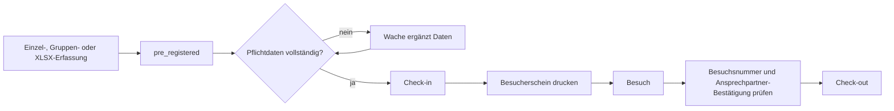
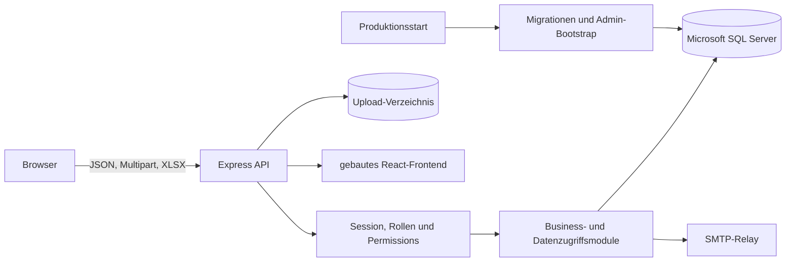

# Projektdokumentation Besucher-Manager – aktueller IST-Zustand

Stand der Codeanalyse: 7. September 2026

Analysierter Git-Stand: `d77d731` (`master`)

Anwendungsversion: `0.2.2`

Diese Dokumentation beschreibt den aktiven TypeScript-Code, die SQL-Migrationen, Tests und Betriebsartefakte. `archive/django-prototype/` ist nur Legacy-Kontext und keine Laufzeitkomponente.

## 1. Kurzüberblick

Der Besucher-Manager bildet die öffentliche Voranmeldung, die operative Arbeit der Wache, vereinfachte Besucherregelungen, Auswertungen für SiBe und KasKdt sowie Administration und Auditierung ab.

Der aktive Stack besteht aus:

- React 18, React Router und Vite im Browser,
- Node.js 22, Express 5 und TypeScript im Backend,
- Microsoft SQL Server als alleinige fachliche Datenbank,
- ExcelJS und JSZip für XLSX-Dateien,
- Nodemailer für SMTP,
- Docker und Docker Compose für Build und Betrieb.

Der zentrale Besuchsablauf lautet:



Die frühere allgemeine Genehmigungslogik wurde mit `023_remove_approvals_add_nationality.sql` entfernt. Eine Entscheidung durch KasKdt existiert weiterhin für den eigenständigen öffentlichen XLSX-Antragsprozess der vereinfachten Besucherregelung.

## 2. Architektur



### Request- und Laufzeitpfad

`apps/backend/src/app.ts` erstellt die Express-Anwendung. Die Reihenfolge umfasst Helmet, Parser, signierte Cookies, Request-ID/Request-Logging, Wartungsmodus, Health- und API-Routen, Uploads und zuletzt das gebaute Frontend.

`apps/backend/src/scripts/start.ts` ist der Produktionsstart. Er:

1. wartet auf eine erreichbare Datenbank,
2. führt ausstehende Migrationen aus,
3. legt den konfigurierten Start-Admin nur an, wenn er noch nicht existiert,
4. startet Erinnerungen alle 15 Minuten,
5. startet die Retention-Prüfung täglich,
6. bindet Express an `APP_HOST`/`APP_PORT`.

`apps/backend/src/server.ts` ist der direkte Entwicklungsstart. Er startet die Anwendung und die beiden Intervalljobs, führt aber keine Migrationen und keinen Admin-Bootstrap aus.

### Repository-Struktur

```text
Besucher_Manager/
├── apps/
│   ├── backend/
│   │   ├── migrations/       # SQL-Migrationen 001 bis 040
│   │   ├── src/lib/          # Geschäftslogik und SQL-Zugriff
│   │   ├── src/routes/       # Express-Routen
│   │   ├── src/scripts/      # Start, Migration und Prüfskripte
│   │   └── src/**/*.test.ts  # Backendtests
│   └── frontend/
│       ├── src/pages/        # Seiten
│       ├── src/components/   # wiederverwendbare UI
│       └── src/**/*.test.*   # Vitest-Tests
├── config/                   # lokale Laufzeitkonfiguration
├── docs/                     # Betriebsanleitungen
├── scripts/ci/               # Docker-E2E
├── scripts/ops/              # Backup, Restore, Update und Prüfungen
├── uploads/                  # Geländepläne und UI-Hintergründe
├── docker-compose.yml
├── Dockerfile
└── package.json
```

`node_modules/` und `dist/` sind generierte Artefakte und keine primäre Quelle für Codeanalysen.

## 3. Rollen, Menüs und Berechtigungen

Die Rollen heißen `admin`, `guard`, `sibe`, `kaskdt` und `custom`. Zusätzlich unterstützt das Datenmodell ausschließlich die Doppelrolle `sibe` + `kaskdt`; andere Rollenkombinationen werden normalisiert oder verworfen.

| Rolle | Standardmenüs | Wesentliche Standardrechte |
|---|---|---|
| `admin` | alle acht Menüs | alle 19 Permission-Schlüssel |
| `guard` | Voranmeldung, Wache, Import | Besuche lesen/anlegen/ändern, Check-in/out, Druck, Import |
| `sibe` | SiBe, Import, Länderbenachrichtigungen | Besuche lesen/anlegen/ändern, Import, SiBe-Dashboard |
| `kaskdt` | KasKdt, Texte, Import | Besuche lesen, KasKdt-Dashboard, Textverwaltung, Import |
| `custom` | keine | ausschließlich explizit gespeicherte Menüs und Rechte |

Die acht Menüschlüssel sind `voranmeldung`, `wache`, `import`, `admin`, `sibe`, `laenderbenachrichtigungen`, `kaskdt` und `texte`.

Backendrouten prüfen Sessions, Rollen und/oder Permission-Schlüssel. Die Frontend-Komponente `RequireRoles` prüft zusätzlich Rollen, Menüs und Rechte. Dadurch sind manche theoretisch konfigurierbaren `custom`-Rechte im Backend vorhanden, aber über die aktuelle Frontend-Rollenliste nicht in jedem Bereich nutzbar.

### Wachen-Scope

Guard-Konten speichern keine dauerhafte Wache. Beim Login wird eine aktive Wache gewählt und in die 12-Stunden-Sitzung übernommen. Listen, Kalender, Details und Mutationen werden für Guard-Benutzer auf dieses Tor eingeschränkt. Ein fehlender Torkontext ergibt einen leeren beziehungsweise verbotenen Guard-Scope.

Admins können torübergreifend arbeiten. Ein Admin wählt bei torbezogenen Wachenaktionen einen gültigen Kontext; unzugeordnete Voranmeldungen können dabei einem Tor zugeordnet werden. Custom-Nutzer mit Guard-Rechten erhalten keinen Admin-Scope.

## 4. Fachliche Prozesse

### Öffentliche Einzel- und Gruppenanmeldung

- Aktive Tore und öffentliche Felddefinitionen werden vor dem Absenden geladen.
- Eine Anmeldung benötigt ein aktives Tor.
- Sichtbarkeit und Pflichtstatus unterstützter Felder stammen aus `field_definitions`.
- Der Server validiert mit Zod und parametrisierten SQL-Abfragen.
- Einzel- und Gruppenanmeldungen erzeugen direkt Besuche mit Status `pre_registered`.
- Gruppenanmeldungen sind auf 50 Personen begrenzt und werden gemeinsam verarbeitet.
- Für Einzelanmeldungen wird ein kryptografisch zufälliger öffentlicher Bestätigungszugang erzeugt; in der Datenbank liegt nur dessen SHA-256-Hash.
- Der öffentliche Bestätigungszugang ist zeitlich und fachlich begrenzt. Interne Felder sowie Ausweisdaten werden nicht im öffentlichen DTO ausgegeben.

### Normaler XLSX-Import

Der normale Import steht öffentlich und mit `imports.execute` intern zur Verfügung. Er besitzt getrennte Preview- und Submit-Schritte. Die Vorlage wird aus den aktuellen Felddefinitionen und aktiven Toren erzeugt.

Die XLSX-Verarbeitung:

- arbeitet im Speicher,
- nutzt ExcelJS und eine vorgeschaltete ZIP/XML-Bereinigung,
- akzeptiert definierte Header-Aliase,
- erhält deutsche Kalenderdaten ohne Zeitzonenverschiebung,
- prüft Pflichtfelder wie das öffentliche Formular,
- ignoriert unveränderte Musterzeilen,
- entfernt problematische Kommentar-Beziehungen,
- weist ungültige oder inzwischen deaktivierte Tore zurück.

### Vereinfachte Besucherregelung

Es existieren drei getrennte Einstiege:

1. SiBe kann einen vereinfachten Besuch über eine Webmaske anlegen.
2. SiBe kann eine spezielle XLSX-Datei vorprüfen und importieren.
3. Ein öffentlicher Antragsteller kann eine XLSX-Datei vorprüfen und als Antrag einreichen.

Beim öffentlichen Antrag werden Dateiinhalte beim Preview und beim Submit neu geparst. Optional ist eine E-Mail-Verifikation erforderlich; Verifikationstoken werden nur gehasht gespeichert. KasKdt oder Admin entscheidet zeilenweise, finalisiert den Antrag und erzeugt daraus höchstens einen Besuch pro genehmigter Zeile. `ROWVERSION`, eindeutige Referenzen und eine Client-Request-ID schützen gegen konkurrierende oder wiederholte Verarbeitung.

Die zugehörigen E-Mails liegen in einer persistenten Outbox. Datensätze werden vor dem Versand atomar beansprucht; fehlgeschlagene Zustellungen können über eine geschützte KasKdt-Route erneut verarbeitet werden.

### Check-in, Druck und Check-out

- Check-in ist nur aus `pre_registered` möglich.
- Konfigurierte Pflichtfelder und eine Torzuordnung werden serverseitig geprüft.
- Änderungen sind nur in erlaubten Zuständen und innerhalb des Benutzer-Scopes möglich.
- Der Besucherschein kann in A4 oder A5 erzeugt werden; Druck und Nachdruck werden auditiert.
- Vor Check-out ist eine Ansprechpartner-Bestätigung erforderlich.
- Die eingegebene zurückgegebene Besuchsnummer muss mit der gespeicherten Nummer übereinstimmen.
- Statusänderungen werden mit Sperren und Auditdaten gespeichert.

### SiBe und Nationalitätsbenachrichtigungen

SiBe kann Besucher und Besuche recherchieren, CSV exportieren, vereinfachte Besuche erfassen und Länderabonnements verwalten. Neue vereinfachte Besuche benachrichtigen abonnierte Benutzer erst nach erfolgreichem Commit. Eine Zustelltabelle verhindert doppelte Benachrichtigungen pro Besuch und Empfänger.

### Administration

Die Administration umfasst:

- Benutzer, Rollen, Gruppen, Menüs und explizite Custom-Rechte,
- CSV-Import und CSV-Export ohne Passwort-Hashes,
- Aktivierung, Deaktivierung und bestätigte Benutzerlöschung,
- physische Löschung unreferenzierter Benutzer oder Tombstone-Pseudonymisierung referenzierter Benutzer,
- Tore,
- Felddefinitionen,
- Badge-/Besucherscheintexte einschließlich freier Abschnitte und Sortierung,
- Geländepläne aus dem versionierten Uploadverzeichnis,
- einen Katalog lokaler UI-Hintergründe mit Vorschaubildern,
- SMTP-/Workfloweinstellungen und Testmails,
- Wartungsmodus,
- Retention,
- Audit- und Fehlerlogs mit geschützter Detailansicht.

Im Wartungsmodus bleiben Health, Authentifizierung, statische Assets und die Admin-Nutzung erreichbar. Andere API-Zugriffe erhalten HTTP 503; Browserseiten zeigen eine deutsche Wartungsseite.

## 5. Frontend-Routen

| Route | Zweck |
|---|---|
| `/`, `/voranmeldung` | öffentliche Voranmeldung beziehungsweise rollenabhängiges Startziel |
| `/visit/confirmation` | öffentlicher, tokenbasierter Bestätigungs- und Bearbeitungszugang |
| `/visit/simplified/application` | öffentlicher XLSX-Antrag der vereinfachten Besucherregelung |
| `/visit/simplified/verify` | E-Mail-Verifikation des öffentlichen XLSX-Antrags |
| `/login` | Login und gegebenenfalls Torauswahl |
| `/einstellungen` | persönliche Einstellungen und Passwortänderung |
| `/wache` | Tagesliste, Kalender, Laufkundschaft und operative Aktionen |
| `/wache/besuche/:id` | Besuchsdetail und Bearbeitung |
| `/wache/besuche/:id/druck` | A4-/A5-Besucherschein |
| `/sibe` | SiBe-Dashboard |
| `/sibe/benachrichtigungen` | Länderabonnements |
| `/sibe/ablehnungen` | abgelehnte Besuche |
| `/sibe/besucher` | Besucher-/Besuchsrecherche und Export |
| `/sibe/besucher/vereinfacht` | vereinfachte SiBe-Web-Erfassung |
| `/kaskdt`, `/kasernenkommandant` | KasKdt-Dashboard |
| `/kaskdt/antraege` | öffentliche vereinfachte XLSX-Anträge entscheiden |
| `/kaskdt/besucher` | vereinfachte Besuche lesen und filtern |
| `/import` | normale und rollenabhängige vereinfachte Imports |
| `/texte` | Textverwaltung für Admin und KasKdt |
| `/admin` | Administration und Betriebsfunktionen |

## 6. Backendmodule und API-Gruppen

### Zentrale Module

| Modul | Verantwortung |
|---|---|
| `authSession.ts` | HMAC-Sitzungstoken und Cookieverwaltung |
| `visitWorkflow.ts` | Rollen, Menüs, Permissions, Status und Übergangsregeln |
| `guardVisits.ts` | Scope, Listen, Details, Walk-in, Update, Check-in/out und Druckvoraussetzungen |
| `publicPreRegistrations.ts` | Einzel- und Gruppenanlage |
| `publicPreRegistrationAccess.ts` | gehashte öffentliche Zugriffstoken und allowlisted DTOs |
| `visitImport*.ts` | normale XLSX-Vorlage, Bereinigung, Preview und Import |
| `publicSimplified*.ts` | öffentlicher vereinfachter XLSX-Antrag, Entscheidung und Outbox |
| `simplifiedSibeEntry*.ts` | vereinfachte SiBe-Erfassung |
| `fieldDefinitions.ts` | konfigurierbare Sichtbarkeit und Pflichtfelder |
| `mailRelay.ts` | SMTP, Mails, HTML/Text und Erinnerungen |
| `retentionCleanup.ts` | gezählte und gebatchte Löschung alter abgeschlossener Vorgänge |
| `users.ts` | Benutzer, Passwort-Hashing und Rollenpersistenz |
| `auditLog.ts`, `errorLogs.ts`, `logRedaction.ts` | Nachweise, Fehlerkorrelation und Secret-Redaktion |
| `uiBackgrounds.ts`, `siteMapCatalog.ts` | sichere lokale Assetkataloge |

### API-Familien

| Präfix | Inhalt |
|---|---|
| `/health`, `/api/health` | Prozess- und Konfigurationsstatus |
| `/api/auth/*` | Sitzung, Login, Torauswahl, Logout und Passwortänderung |
| `/api/public/*` | Tore, Voranmeldungen, Bestätigungszugang und öffentliche Imports |
| `/api/guard/*` | Wachenlisten und operative Besuchsaktionen |
| `/api/sibe/*` | Recherche, Auswertung, vereinfachte Erfassung und Länderabonnements |
| `/api/kaskdt/*` | Antragsentscheidungen und vereinfachte Besuchsliste |
| `/api/admin/*` | Benutzer, Tore, Assets, Settings, Retention und Logs |
| `/api/field-definitions` | öffentliche Feldmetadaten nach Kontext |

Es gibt keine zentrale OpenAPI-Spezifikation. Verbindliche Request- und Responseformen ergeben sich aus den Zod-Schemas, Routendateien und Tests.

## 7. Datenbank und Migrationen

Das Schema entsteht aus den Migrationen `001_...` bis `040_...`. Es existieren zwei Migrationen mit numerischem Präfix `023`; der Runner verwaltet vollständige Dateinamen, trotzdem sind neue Präfixe künftig eindeutig zu vergeben.

Wichtige Datenbereiche sind:

- Benutzer, Gruppen und Menüzugriffe,
- Tore,
- Besucher und Besuche,
- konfigurierbare Felddefinitionen und Feldwerte,
- Badge-/Besucherscheintexte,
- Audit- und Fehlerlogs,
- Systemeinstellungen,
- Nationalitätsabonnements und Zustellnachweise,
- öffentliche Zugriffstoken,
- öffentliche vereinfachte Anträge, Einträge und Mail-Outbox.

`023_remove_approvals_add_nationality.sql` ist destruktiv: Die frühere allgemeine Genehmigungslogik und zugehörige Daten werden entfernt. Vor dem ersten Update über diese Migration ist das dokumentierte, verifizierte SQL-Backup zwingend.

### Retention

Retention ist implementiert und im Adminbereich konfigurierbar. Der Standardwert beträgt zehn Jahre; die automatische Löschung ist nur aktiv, wenn sie eingeschaltet wurde. Gelöscht werden alte Besuche in `checked_out`, `cancelled` oder `rejected`, jeweils in Batches von 500. Ein Besucher wird nur gelöscht, wenn danach kein weiterer Besuch auf ihn verweist. Admins können die Bereinigung manuell auslösen.

Die separate Archivierungsroute markiert einen Besucher logisch als gelöscht/inaktiv. Sie ist nicht mit der physischen Retention-Löschung gleichzusetzen.

## 8. Authentifizierung und Sicherheit

### Implementierte Kontrollen

- Passwörter werden mit bcrypt, Kostenfaktor 12, gespeichert.
- Die Sitzung ist ein HMAC-SHA-256-signiertes Cookie mit 12 Stunden Laufzeit, `HttpOnly` und `SameSite=Strict`.
- Der aktuelle Benutzer und seine Rechte werden bei jedem authentifizierten Request erneut aus der Datenbank geladen; Deaktivierung wirkt dadurch sofort.
- SQL-Zugriffe verwenden überwiegend Parameter statt zusammengesetzter Benutzereingaben.
- Guard-Lese- und Schreibzugriffe sind torbezogen.
- Öffentliche Bestätigungs- und Verifikationstoken werden nur gehasht gespeichert.
- Öffentliche Bestätigungsseiten setzen `no-store` und `Referrer-Policy: no-referrer`.
- XLSX-Uploads werden auf zentrale Größen-, Zeilen-, Sheet-, Formel-, Makro- und External-Link-Regeln geprüft.
- Audit- und Fehlerdetails besitzen eigene Permissions; Secret-ähnliche Werte werden rekursiv redigiert.
- Request-IDs erscheinen in Response, strukturiertem Requestlog und Fehlerdatensatz.
- Docker-E2E-, Backup- und Restore-Skripte enthalten Guards gegen Produktions-Compose-Namen und ungesicherte Löschungen.

### Verbleibende Grenzen und Risiken

1. **CSRF ist nicht vollständig vereinheitlicht.** Öffentliche normale XLSX-Mutationen und der öffentliche vereinfachte XLSX-Prozess prüfen Cookie und `X-CSRF-Token` timing-sicher. Die Einzel- und Gruppen-Voranmeldungsrouten prüfen den ausgegebenen Token derzeit nicht serverseitig.
2. **Rate Limits sind pro Prozess.** Die Buckets liegen im Speicher, verschwinden beim Neustart und werden zwischen mehreren Instanzen nicht geteilt. Der Login besitzt kein eigenes Rate Limit; Passwortänderung und öffentliche Schreibpfade sind begrenzt.
3. **Sitzungen sind zustandslos.** Logout löscht nur das Browsercookie. Eine Passwortänderung widerruft bereits ausgestellte Cookies nicht vor Ablauf; Benutzerdeaktivierung greift wegen der DB-Auflösung dennoch.
4. **CSP ist deaktiviert.** Helmet setzt weitere Header, aber `contentSecurityPolicy: false` lässt eine zusätzliche Browser-Schutzschicht aus.
5. **Sensible Besucherdaten sind im SQL-Schema nicht anwendungsseitig verschlüsselt.** Schutz hängt von Datenminimierung, Berechtigungen, SQL-/Datenträgerverschlüsselung, Backups und wirksamer Retention ab.
6. **Health prüft keine Live-SQL-Abfrage.** `/health` meldet Prozessstatus und ob wesentliche DB-Variablen gesetzt sind, nicht die aktuelle Erreichbarkeit des SQL Servers.
7. **E-Mail-Zuverlässigkeit ist uneinheitlich.** Der öffentliche vereinfachte Antrag besitzt eine persistente Outbox; andere Workflowmails und Erinnerungen verwenden keinen allgemeinen dauerhaften Queue-/Retry-Dienst.
8. **Custom-UI und Backendmodell sind nicht vollständig deckungsgleich.** Einige Seiten schließen `custom` über feste Rollenlisten aus, obwohl passende Backend-Permissions modelliert sind.
9. **Die Beispielkonfiguration ist widersprüchlich.** `.env.example` setzt `APP_SECURE_COOKIES` zuerst auf `true` und später nochmals auf `false`; für Produktion muss der Wert bewusst auf `true` gesetzt werden.

## 9. E-Mail und Hintergrundjobs

SMTP wird aus `config/mail-relay.yml` oder administrierbaren Systemeinstellungen geladen. TLS-Zertifikatsprüfung bleibt aktiv; interne CAs können über `NODE_EXTRA_CA_CERTS` bereitgestellt werden. Text- und HTML-Ausgabe ist konfigurierbar, dynamische Inhalte werden für HTML escaped.

Im Webprozess laufen zwei Intervalle:

- Besuchserinnerungen beim Start und alle 15 Minuten,
- Retention beim Start und alle 24 Stunden.

Für horizontale Mehrinstanz-Deployments gibt es keine zentrale Jobkoordination. Zustelltabellen und atomare Outbox-Claims reduzieren Duplikate in den dafür vorgesehenen Flows, ersetzen aber keinen allgemeinen Scheduler.

## 10. Konfiguration und Deployment

Secrets und produktive Werte gehören ausschließlich in `.env` beziehungsweise gemountete Konfigurationsdateien. `.env`, Mail-Relay-Zugangsdaten, private CA-Dateien, Backups, Logs, Uploadzustand und generierte Builds dürfen nicht als neue lokale Artefakte committed werden.

Wesentliche Variablen:

- `APP_HOST`, `PORT`, `PUBLIC_BASE_URL`, `APP_SECRET`, `APP_SECURE_COOKIES`, `APP_TRUST_PROXY`,
- `MSSQL_HOST`, `MSSQL_PORT`, `MSSQL_DATABASE`, `MSSQL_USER`, `MSSQL_PASSWORD`,
- `ADMIN_USERNAME`, `ADMIN_PASSWORD`,
- `UPLOAD_DIR`, `MAIL_RELAY_CONFIG_PATH`, `MAIL_RELAY_TLS_SERVERNAME`, `NODE_EXTRA_CA_CERTS`,
- `PUBLIC_FORM_RATE_LIMIT`, `PUBLIC_FORM_RATE_WINDOW_SECONDS`,
- `HTTP_PROXY`, `HTTPS_PROXY`, `NO_PROXY` und die kleingeschriebenen Varianten.

`docker-compose.yml` enthält die Anwendung und das optionale Profil `local-db` mit SQL Server, DB-Bootstrap und Mailpit. Uploads und `config/` werden vom Host eingebunden; die lokale SQL-Datenbank verwendet das Volume `sqlserver_data`.

Für einen sauberen Produktionsserver auf `master` ist der vorgesehene Updateeinstieg:

```bash
npm run ops:update -- --git-pull
```

Das Update muss vor Änderungen ein SQL-Backup erzeugen und darf weder `docker compose down -v` noch eine Bereinigung des Produktions-Volumes ausführen. Der Live-Erfolg ist erst nach Containerstatus, Healthcheck, Logs und fachlichem Smoke-Test bestätigt. Details stehen in `DEPLOYMENT.md` und `docs/update.md`.

Ein Reverse Proxy, TLS-Terminierung, zentrale Secretverwaltung, zentrale Metriken und HA sind nicht Bestandteil des Repositories.

## 11. Verifikation dieses Dokumentationsstands

Am 7. September 2026 wurden auf `d77d731` ausgeführt:

| Prüfung | Ergebnis |
|---|---|
| `npm run typecheck` | erfolgreich |
| `npm run test:backend` | 159 von 159 Tests bestanden |
| `npm run test:frontend` | 20 Testdateien, 65 von 65 Tests bestanden |
| `npm run build` | Backend- und Frontend-Build erfolgreich |

Die Frontendtests melden ausschließlich bekannte React-Router-Future-Flag-Warnungen. Es gab keine fehlgeschlagenen oder übersprungenen Tests.

Die Tests decken unter anderem Gate-Scope, Statusübergänge, Pflichtfelder, Badge-Rückgabe, CSRF der XLSX-Flows, Rate Limits, Token-Hashing, XLSX-Härtung, idempotente Anträge, Outbox-Claims, Retention-Batches, Benutzerlöschung, Log-Redaktion sowie Docker-/Backup-Schutzregeln ab.

Nicht durch diese lokalen Läufe bestätigt sind ein echter MSSQL-Migrationslauf, Docker-E2E, SMTP-Zustellung, Proxykonfiguration und ein Live-Deployment.

## 12. Priorisierte weitere Arbeiten

1. CSRF-Prüfung auf alle öffentlichen zustandsändernden Routen vereinheitlichen.
2. Login-Rate-Limit und bei Mehrinstanzbetrieb einen gemeinsamen Rate-Limit-Speicher einführen.
3. Sitzungswiderruf bei Passwortwechsel sowie ein bewusstes Session-Management konzipieren.
4. Eine restriktive, getestete Content-Security-Policy aktivieren.
5. Schutz und Lebenszyklus sensibler Ausweisdaten einschließlich Verschlüsselung, Backups und Löschkonzept regelmäßig prüfen.
6. Readiness mit echter DB-Abfrage getrennt vom einfachen Liveness-Endpunkt bereitstellen.
7. Mailzustellung außerhalb des vereinfachten öffentlichen Antrags in eine dauerhafte Queue/Outbox überführen.
8. Custom-Rollen zwischen Backend-Permissions, Menüs und Frontend-Routenschutz konsistent machen.
9. Die beiden Migrationen mit Präfix 023 als historische Besonderheit dokumentiert lassen und künftig eindeutige fortlaufende Präfixe verwenden.
10. Vor einer Produktionsfreigabe Docker-E2E, Restore-Test und den vollständigen fachlichen MVP-Smoke-Test auf einer isolierten Umgebung ausführen.

## 13. Einstiegspunkte für Entwickler

1. `apps/backend/src/scripts/start.ts` – Produktionsstart und Jobs.
2. `apps/backend/src/app.ts` – Middleware, Wartungsmodus und statische Auslieferung.
3. `apps/backend/src/routes/api.ts` – Authentifizierung und öffentliche Standardflüsse.
4. `apps/backend/src/routes/guard.ts` – operative Wachen-API.
5. `apps/backend/src/routes/sibe.ts` – SiBe/KasKdt-Auswertungen und vereinfachte Erfassung.
6. `apps/backend/src/routes/publicSimplifiedApplications.ts` – öffentlicher XLSX-Antragsworkflow.
7. `apps/backend/src/routes/admin.ts` – Administration, Logs, Wartung und Retention.
8. `apps/backend/src/lib/visitWorkflow.ts` – Rollen, Menüs und Statusregeln.
9. `apps/backend/src/lib/guardVisits.ts` – Gate-Scope und Besuchsmutationen.
10. `apps/backend/migrations/` – verbindliche Schemaentwicklung.
11. `apps/frontend/src/App.tsx` – Browserrouting und Rollenschutz.
12. `README.md`, `DEPLOYMENT.md`, `docs/update.md` – Nutzung und Betrieb.
