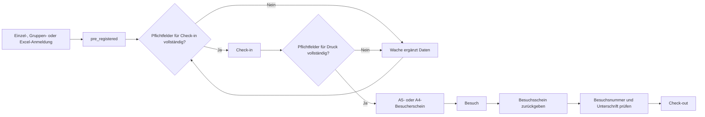

# Besucher Manager

Interne, rollenbasierte Besucherverwaltung für Voranmeldung, Wache, Sicherheitsbeauftragte, Kasernenkommandantur und Administration.

Die Anwendung bildet den vollständigen Ablauf vom Erfassen eines Besuchs über Check-in und Besucherscheindruck bis zum Check-out und Auditlog ab. Sie läuft als TypeScript-Monorepo mit React, Express und Microsoft SQL Server.

> [!IMPORTANT]
> Vor dem ersten produktiven Start dieser Version muss ein geprüftes SQL-Backup vorhanden sein. Die Migration `023_remove_approvals_add_nationality.sql` entfernt die frühere Genehmigungslogik und zugehörige Datenbankspalten dauerhaft.

## Inhaltsverzeichnis

- [Funktionsumfang](#funktionsumfang)
- [Besuchsworkflow](#besuchsworkflow)
- [Rollen und Berechtigungen](#rollen-und-berechtigungen)
- [Technische Architektur](#technische-architektur)
- [Lokale Entwicklung](#lokale-entwicklung)
- [Konfiguration](#konfiguration)
- [E-Mail und Länderbenachrichtigungen](#e-mail-und-länderbenachrichtigungen)
- [Import und Export](#import-und-export)
- [Feldkonfiguration](#feldkonfiguration)
- [Besucherschein und Druck](#besucherschein-und-druck)
- [Wichtige Routen und APIs](#wichtige-routen-und-apis)
- [Tests und Qualitätssicherung](#tests-und-qualitätssicherung)
- [Datenhaltung und Migrationen](#datenhaltung-und-migrationen)
- [Sicherheit](#sicherheit)
- [Deployment](#deployment)
- [Betrieb und Fehleranalyse](#betrieb-und-fehleranalyse)

## Funktionsumfang

### Voranmeldung

- Öffentliche Einzelanmeldung
- Öffentliche Gruppenanmeldung mit gemeinsamen Besuchsdaten
- Standardauswahl `Deutschland (DE)` in interaktiven Formularen
- Erfassung einer ISO-3166-1-Nationalität
- Erfassung von Besucher-, Ansprechpartner-, Besuchs- und Ausweisdaten
- Ausweisarten:
  - Personalausweis
  - Reisepass
  - Dienstausweis
  - Sonstiges
- CSRF-Schutz und Rate-Limiting für öffentliche Endpunkte
- Direkte Anlage als `pre_registered`; es gibt keinen Genehmigungsschritt

### Wache

- Tagesliste und Kalenderansicht
- Suche und Statusfilter
- Spontane Besucheraufnahme
- Nachbearbeitung von Voranmeldungen
- Check-in anhand konfigurierter Pflichtfelder
- Besucherscheindruck in A5 oder A4
- Check-out mit zurückgegebener Besuchsnummer und Ansprechpartnerbestätigung
- Wachen-Scope für Guard-Benutzer
- Auditierung aller wesentlichen Aktionen

### SiBe

- Besuchs- und Besucherrecherche
- Detailansicht mit Nationalität und Besuchsverlauf
- CSV-Auswertung
- Suchbare Länderabonnements
- „Alle auswählen“ und „Alle abwählen“
- E-Mail-Benachrichtigung für abonnierte Nationalitäten
- Höchstens eine Länder-E-Mail je Besuch und SiBe-Benutzer

### KasKdt und Textverwaltung

- Suche und Filterung von Texten
- Anlegen, Bearbeiten und Duplizieren
- Aktivieren und Deaktivieren
- Vorschau und Druckvorschau
- Zugriff für Admin und KasKdt über `texts.manage`

### Administration

- Wachenverwaltung
- Benutzer-, Rollen-, Gruppen- und Menüzugriffsverwaltung
- Benutzerimport per CSV
- Benutzerexport per CSV ohne Passwörter oder Passwort-Hashes
- Systemfeld- und Pflichtfeldkonfiguration
- Geländeplan- und Hintergrundverwaltung
- SMTP-Konfiguration und Testmails
- Audit- und Fehlerlog
- Systemstatus

## Besuchsworkflow



Nationalitätsmeldungen laufen unabhängig vom operativen Ablauf. Ein SMTP-Fehler wird protokolliert, blockiert aber weder Voranmeldung noch Check-in.

## Rollen und Berechtigungen

| Rolle | Standardbereiche | Besonderheiten |
|---|---|---|
| Nicht angemeldet | Voranmeldung, Gruppenanmeldung, öffentlicher Excel-Import, Login | Öffentliche Endpunkte sind CSRF- und rate-limit-geschützt |
| `guard` | Wache, Import | Wählt beim Login eine aktive Wache; Zugriff auf den eigenen Wachenbereich |
| `sibe` | SiBe, Import | Kann Länder abonnieren und Besucher recherchieren |
| `kaskdt` | KasKdt, Texte | Darf die vollständige Textverwaltung nutzen |
| `admin` | Alle Bereiche | Benutzer-, System-, Feld-, Text- und Betriebsverwaltung |
| `custom` | Individuell | Menüs und fachliche Berechtigungen werden explizit gesetzt |

Menüzugriffe und API-Berechtigungen werden serverseitig geprüft. Eine ausgeblendete Frontend-Navigation ist kein Ersatz für die API-Prüfung.

## Technische Architektur

| Bereich | Technologie |
|---|---|
| Frontend | React 18, React Router, Vite, TypeScript |
| Backend | Node.js 22, Express, TypeScript |
| Validierung | Zod |
| Datenbank | Microsoft SQL Server |
| Excel | ExcelJS und SheetJS |
| E-Mail | Nodemailer, SMTP-Relay |
| Betrieb | Docker, Docker Compose |

### Repository-Struktur

```text
.
├── apps/
│   ├── backend/
│   │   ├── migrations/       # Versionierte SQL-Migrationen
│   │   ├── src/              # API, Geschäftslogik und Tests
│   │   └── dist/             # Kompilierte Backend-Ausgabe
│   └── frontend/
│       ├── src/              # React-Anwendung
│       └── dist/             # Produktionsbuild
├── config/                   # Laufzeitkonfiguration, z. B. SMTP-YAML
├── docs/                     # Ergänzende Betriebsdokumentation
├── scripts/
│   ├── ci/                   # Docker-E2E
│   └── ops/                  # Backup, Update und Betriebsprüfungen
├── docker-compose.yml
├── Dockerfile
├── README.md
└── DEPLOYMENT.md
```

## Lokale Entwicklung

### Voraussetzungen

- Node.js `>= 22`
- npm
- Zugriff auf Microsoft SQL Server
- optional Docker und Docker Compose

### Installation

```bash
git clone https://github.com/linuxlearner-germany/Besucher_Manager.git
cd Besucher_Manager
cp .env.example .env
npm ci
```

Danach die Datenbankwerte und lokalen Secrets in `.env` eintragen.

### Entwicklungsserver

Backend:

```bash
npm run dev:backend
```

Frontend in einem zweiten Terminal:

```bash
npm run dev:frontend
```

### Lokaler Produktionsbuild

```bash
npm run typecheck
npm run test:backend
npm run build
```

### Lokale SQL-Server-Container

Die SQL-Dienste besitzen das Compose-Profil `local-db`:

```bash
docker compose --profile local-db up -d sqlserver db-bootstrap
```

Für die Anwendung muss `MSSQL_HOST=sqlserver` gesetzt sein, wenn sie ebenfalls im Compose-Netz läuft.

## Konfiguration

Die Anwendung liest ihre Laufzeitkonfiguration aus `.env`. Diese Datei darf nicht eingecheckt werden.

### Zentrale Variablen

| Variable | Beschreibung | Beispiel |
|---|---|---|
| `NODE_ENV` | Laufzeitmodus | `production` |
| `APP_HOST` | Bind-Adresse im Container | `0.0.0.0` |
| `PORT` | veröffentlichter App-Port | `3030` |
| `PUBLIC_BASE_URL` | Extern erreichbare Basis-URL für Links in E-Mails | `https://besucher.example.intern` |
| `APP_SECRET` | Starkes, zufälliges Session-/Anwendungssecret | mindestens 32 zufällige Zeichen |
| `APP_SECURE_COOKIES` | Sichere Cookies bei HTTPS | `true` |
| `APP_TRUST_PROXY` | Vertrauensregel für Reverse Proxy | konkrete Proxy-IP/CIDR oder `true` |
| `MSSQL_HOST` | SQL-Server-Hostname | `sqlserver` |
| `MSSQL_PORT` | SQL-Port | `1433` |
| `MSSQL_DATABASE` | Datenbankname | `BesucherManager` |
| `MSSQL_USER` | Anwendungslogin | `besucher_app` |
| `MSSQL_PASSWORD` | SQL-Passwort | lokales Secret |
| `UPLOAD_DIR` | Persistenter Uploadpfad | `/app/uploads` |
| `ADMIN_USERNAME` | Initialer Adminname | `admin` |
| `ADMIN_PASSWORD` | Initiales Adminpasswort | lokales Secret |
| `MAIL_RELAY_CONFIG_PATH` | SMTP-YAML im Container | `/app/config/mail-relay.yml` |

Die vollständige Vorlage steht in [`.env.example`](.env.example).

> [!NOTE]
> Beim Containerstart wird ein Admin nur angelegt, wenn der konfigurierte Benutzer noch nicht existiert. Vorhandene Zugangsdaten und Profildaten werden nicht bei jedem Start überschrieben.

## E-Mail und Länderbenachrichtigungen

### SMTP-Konfiguration

Empfohlen wird eine lokale Datei `config/mail-relay.yml`, ausgehend von [config/mail-relay.yml.example](config/mail-relay.yml.example):

```yaml
mailRelay:
  enabled: true
  host: smtp-relay.intern.example
  port: 587
  secure: false
  username: relay-user
  password: relay-pass
  fromAddress: "Besucher Manager <noreply@example.org>"
```

Die Datei wird über `./config:/app/config:ro` schreibgeschützt in den Container eingebunden. Ist sie vorhanden, dient sie als maßgebliche Relay-Konfiguration.

### Versandlogik

Eine Meldung wird erzeugt, wenn:

1. ein Besuch mit gültiger Nationalität neu angelegt wird oder
2. bei einem bestehenden Besuch erstmals eine Nationalität ergänzt wird.

Empfänger sind aktive SiBe-Benutzer, die:

- das Land zum Ereigniszeitpunkt abonniert haben und
- eine Benutzer-E-Mail besitzen.

Spätere Änderungen der Nationalität erzeugen keine zweite Nachricht. Zustellfehler werden im Fehlerlog vermerkt und blockieren die Anmeldung nicht.

### Inhalt einer Meldung

```text
Betreff: Nationalitätsmeldung: Frankreich – Max Mustermann

Für ein abonniertes Land wurde ein Besuch angemeldet.

Nationalität: Frankreich (FR)
Besucher: Max Mustermann
Firma: Musterfirma GmbH
Besuchszeitraum: 2026-07-27 bis 2026-07-28
Wache: Hauptwache

Details: https://besucher.example.intern/sibe/besucher/<visit-id>
```

## Import und Export

### Besucherimport

- Formate: `XLSX`, `XLS`
- Öffentlicher und interner Import
- Downloadbare Excel-Vorlage
- Versteckte vollständige Länderliste mit 249 ISO-3166-1-Einträgen
- Dropdown für Nationalität und Ausweisart
- „Dienstausweis“ wird unterstützt
- Leere oder unbekannte Nationalitäten lehnen die gesamte Datei vor dem ersten Insert ab
- Die Fehlermeldung nennt alle betroffenen Excel-Zeilen

### Benutzerimport

Im Admincenter kann eine CSV-Vorlage heruntergeladen und anschließend importiert werden.

```csv
username,password,role,displayName,email,groups,menuAccess,isActive
```

Bestehende Konten werden anhand des Benutzernamens aktualisiert. Neue Konten benötigen ein Passwort.

### Benutzerexport

Admins mit `admin.users` können alle Benutzer als CSV exportieren:

```csv
username,role,displayName,email,gate,groups,menuAccess,isActive,lastLoginAt
```

Passwörter und Passwort-Hashes werden niemals exportiert. Jeder Export wird im Auditlog als `ADMIN_USERS_EXPORTED_CSV` dokumentiert.

## Feldkonfiguration

Das Feldcenter verwaltet ausschließlich unterstützte Systemfelder. Freie Zusatzfelder können nicht angelegt werden.

Pro Feld lassen sich konfigurieren:

- Sichtbarkeit in der Voranmeldung
- Sichtbarkeit bei der Wache
- Sichtbarkeit für SiBe
- Sichtbarkeit auf dem Besucherschein
- Pflicht in der Voranmeldung
- Pflicht vor Check-in
- Pflicht vor Druck

Ein Pflichtschalter aktiviert automatisch die zugehörige Sichtbarkeit. Versteckte Felder werden im jeweiligen Kontext nicht verlangt.

Die Feldkonfiguration kann als versioniertes JSON exportiert und wieder importiert werden. Beim Import werden nur bekannte Systemfeldschlüssel aktualisiert; unbekannte Schlüssel werden übersprungen.

## Besucherschein und Druck

Die Druckansicht befindet sich unter `/wache/besuche/:id/druck`.

### A5

- Hochformat
- Seite 1: Besucher-, Besuchs-, Nationalitäts- und Ausweisdaten, Gültigkeit und Unterschrift
- Seite 2: Geländeplan, Sicherheits- und Rückgabehinweise

### A4

- Hochformat
- Vorderseite: vollständige Besuchsdaten und großer Unterschriftsbereich
- Rückseite: Geländeplan und Hinweise
- für Duplexdruck „an langer Kante wenden“

Die letzte Formatwahl wird im Browser gespeichert. Das gewählte Format wird im Druckaudit als `paperSize: "A4" | "A5"` abgelegt.

> [!TIP]
> Im Browserdruckdialog Kopf- und Fußzeilen deaktivieren. A4 sollte als Duplexdruck an der langen Kante ausgegeben werden.

## Wichtige Routen und APIs

### Frontend

| Route | Zweck |
|---|---|
| `/` | Öffentliche Einzel- und Gruppenanmeldung |
| `/login` | Anmeldung |
| `/wache` | Wachenübersicht und Kalender |
| `/wache/besuche/:id` | Besuch bearbeiten |
| `/wache/besuche/:id/druck` | A4-/A5-Druckansicht |
| `/import` | Besucherimport |
| `/sibe` | SiBe-Dashboard und Länderabonnements |
| `/sibe/besucher` | Besucher- und Besuchsrecherche |
| `/sibe/benutzer` | Benutzerrecherche |
| `/kaskdt` | KasKdt-Dashboard |
| `/kaskdt/texte` | Textverwaltung |
| `/admin` | Administration |

### Ausgewählte APIs

| Methode und Pfad | Zweck |
|---|---|
| `GET /health` | einfacher Healthcheck |
| `GET /api/health` | API-Healthcheck |
| `GET /api/countries` | vollständiger Länderkatalog |
| `GET /api/field-definitions?context=public` | aktive Felddefinitionen |
| `GET /api/sibe/nationality-subscriptions` | eigenes Länderabonnement |
| `PUT /api/sibe/nationality-subscriptions` | Länderabonnement speichern |
| `POST /api/guard/visits/:id/print-log` | Druckaudit mit Papierformat |
| `GET /api/admin/users/export.csv` | Benutzerexport |
| `GET /api/admin/users/import-template.csv` | Benutzerimportvorlage |

## Tests und Qualitätssicherung

### Standardprüfungen

```bash
npm ci
npm run typecheck
npm run test:backend
npm run build
```

### Docker-End-to-End-Test

```bash
bash scripts/ci/run_docker_e2e.sh
```

Der Lauf baut einen Produktionscontainer, startet eine saubere Umgebung, führt Migrationen und Seed aus und prüft Rollen sowie den operativen Besuchsworkflow.

### Betriebsprüfungen

```bash
npm run seed:sample
npm run verify:roles
npm run verify:mvp
npm run verify:ops
```

Offene oder nachgereichte Unterschriften lassen sich exportieren:

```bash
npm run report:signatures > unterschriften.csv
```

## Datenhaltung und Migrationen

Migrationen liegen unter `apps/backend/migrations` und werden beim Containerstart in Dateinamenreihenfolge ausgeführt. Erfolgreiche Migrationen werden in `dbo.schema_migrations` registriert.

Wichtige Tabellen:

| Tabelle | Inhalt |
|---|---|
| `users` | Anwendungskonten und Rollen |
| `user_groups` | Benutzergruppen |
| `user_menu_access` | freigeschaltete Menüs |
| `user_nationality_subscriptions` | Länderabonnements je Benutzer |
| `nationality_notification_deliveries` | idempotente Versandereignisse |
| `visitors` | Besucherstammdaten einschließlich Nationalität |
| `visits` | konkrete Besuchsvorgänge |
| `field_definitions` | Systemfeld- und Pflichtfeldmatrix |
| `badge_text_templates` | Texte für Besucherschein und Hinweise |
| `site_maps` | Geländepläne |
| `audit_logs` | fachliche und administrative Aktionen |
| `error_logs` | technische Fehler |
| `schema_migrations` | angewandte Migrationen |

Kernobjekte werden im normalen UI-Ablauf deaktiviert, archiviert oder storniert, nicht physisch gelöscht. Ausgenommen sind ausdrücklich dokumentierte destruktive Schema-Migrationen.

## Sicherheit

- Keine Secrets in Git
- Passwörter ausschließlich gehasht in der Datenbank
- Keine Passwörter im Benutzerexport
- Serverseitige Rollen-, Menü-, Berechtigungs- und Wachenprüfung
- CSRF-Schutz und Rate-Limit für öffentliche Schreibzugriffe
- Sichere Cookies im HTTPS-Betrieb
- Auditierung administrativer und operativer Aktionen
- Keine Klartext-Ausweisnummern im Auditlog
- Restriktive Uploadtypen und Größenlimits
- SMTP-Fehler blockieren keine Besuchsanmeldung

> [!WARNING]
> `APP_TRUST_PROXY=true` darf nur verwendet werden, wenn der Dienst tatsächlich ausschließlich hinter einem vertrauenswürdigen Reverse Proxy erreichbar ist. Bevorzugt wird eine konkrete Proxy-IP oder ein CIDR.

## Deployment

Die vollständige Installations-, Update-, Backup- und Rollback-Anleitung steht in [DEPLOYMENT.md](DEPLOYMENT.md).

Kurzfassung für eine bereits eingerichtete Docker-Installation:

```bash
npm run ops:update -- --pull
```

Der Update-Wrapper erstellt standardmäßig zuerst ein SQL-Backup, baut anschließend das Image und wartet auf einen gesunden App-Container.

## Betrieb und Fehleranalyse

### Status

```bash
docker compose ps
curl -fsS http://127.0.0.1:3030/health
```

### Logs

```bash
docker compose logs --tail=200 app
docker compose logs -f app
```

### Backup

Für den lokalen Compose-SQL-Server:

```bash
npm run ops:backup
```

Backups werden standardmäßig nach `archive/backups/` geschrieben.

### Häufige Ursachen

| Symptom | Prüfung |
|---|---|
| App startet nicht | `docker compose logs app`, SQL-Verbindung und `.env` prüfen |
| `ELOGIN` | SQL-Benutzer, Passwort, Datenbank und Bootstrap prüfen |
| E-Mail kommt nicht | Relay-YAML, Benutzer-E-Mail, Länderabonnement und Fehlerlog prüfen |
| Login-Schleife hinter HTTPS | `PUBLIC_BASE_URL`, `APP_SECURE_COOKIES` und `APP_TRUST_PROXY` prüfen |
| Upload fehlt nach Update | Mount und Volume `uploads_data` prüfen |
| Druck hat Browserzeilen | Kopf-/Fußzeilen im Browserdruckdialog deaktivieren |

Weitere Hinweise:

- [Deployment hinter Internet-Security-Proxy](docs/deployment-internet-security-proxy.md)
- [Update-Anleitung](docs/update.md)
