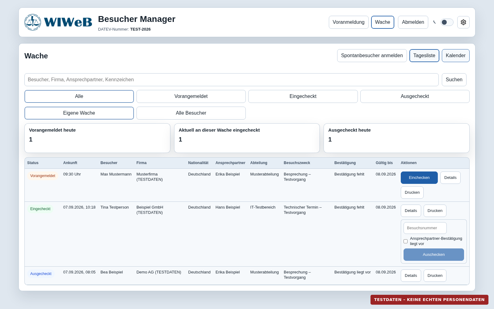
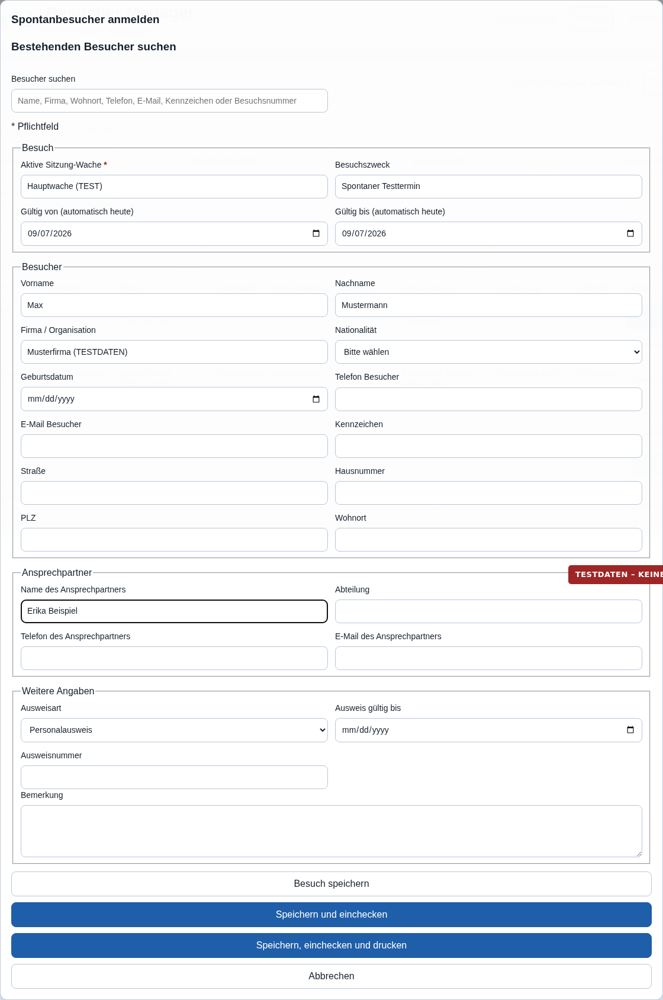

# Benutzeranleitung für die Wache

Diese Anleitung beschreibt den täglichen Ablauf für Benutzerinnen und Benutzer der Rolle **Wache**: anmelden, Besuche finden, Personen einchecken, Besucherscheine drucken, Spontanbesuche erfassen und Besuche auschecken.

> [!IMPORTANT]
> Die Screenshots zeigen ausschließlich Testdaten. Im Echtbetrieb dürfen Besucherdaten nur für den vorgesehenen dienstlichen Zweck verarbeitet und nicht außerhalb des Besucher Managers gespeichert oder weitergegeben werden.

## Schnellübersicht

1. Mit dem persönlichen Benutzerkonto anmelden und die besetzte Wache auswählen.
2. Den Besuch in der Tagesliste suchen oder einen Spontanbesuch anlegen.
3. Person und Besuchsdaten prüfen; fehlende Pflichtfelder ergänzen.
4. Den Besuch einchecken und den Besucherschein ausgeben.
5. Bei Rückkehr Besuchsnummer und Ansprechpartner-Bestätigung prüfen.
6. Den Besuch auschecken und anschließend abmelden.

## 1. Anmelden und Wache auswählen

1. Den Besucher Manager im dienstlichen Browser öffnen.
2. **Benutzername** und **Passwort** eingeben und **Anmelden** wählen.
3. Unter **Aktive Wache** die Wache auswählen, die aktuell besetzt wird.
4. Mit **Weiter** bestätigen.

Die ausgewählte Wache ist für die laufende Sitzung maßgeblich. Wird versehentlich die falsche Wache ausgewählt, oben **Abmelden** wählen und die Anmeldung mit der richtigen Wache wiederholen.

> [!CAUTION]
> Benutzerkonto und Passwort nicht weitergeben. Beim Verlassen des Arbeitsplatzes den Bildschirm sperren; nach Dienstende immer abmelden.

## 2. Wachenübersicht verwenden

Nach der Anmeldung öffnet sich die Wachenübersicht.

Die wichtigsten Bereiche sind:

| Bereich | Verwendung |
|---|---|
| **Spontanbesucher anmelden** | Nicht vorangemeldeten Besuch neu erfassen |
| **Tagesliste** | Besuche des ausgewählten Tages bearbeiten |
| **Kalender** | Einen anderen Besuchstag auswählen |
| **Suche** | Nach Besuchername, Firma, Wohnort, Telefon, E-Mail, Kennzeichen oder Besuchsnummer suchen |
| **Alle / Vorangemeldet / Eingecheckt / Ausgecheckt** | Liste nach Bearbeitungsstatus filtern |
| **Eigene Wache / Alle Besucher** | Sichtbare Besuche im zulässigen Wachenbereich eingrenzen |

### Bedeutung der Statusanzeigen

| Status | Bedeutung | Nächster üblicher Schritt |
|---|---|---|
| **Vorangemeldet** | Der Besuch wurde erfasst, ist aber noch nicht eingecheckt. | Daten prüfen und **Einchecken** wählen. |
| **Eingecheckt** | Die Person befindet sich auf dem Gelände. | Besucherschein drucken beziehungsweise bei Rückkehr auschecken. |
| **Ausgecheckt** | Der Besuch wurde beendet. | Keine weitere Bearbeitung erforderlich. |

Mit **Details** wird der vollständige Besuch geöffnet. **Drucken** öffnet den Besucherschein. Bei eingecheckten Besuchen kann der Check-out auch direkt in der Tagesliste vorbereitet werden.

## 3. Vorangemeldeten Besuch einchecken

1. In der Tagesliste den Besuch suchen.
2. Namen, Firma, Ansprechpartner, Besuchszweck, Gültigkeit und ausgewählte Wache mit der vorliegenden Anmeldung abgleichen.
3. **Details** öffnen.
4. Die Hinweise unter **Prüfung** beachten. Fehlende Pflichtangaben über **Daten bearbeiten** ergänzen.
5. Die Identität nach der örtlich geltenden Dienstanweisung prüfen.
6. **Einchecken** wählen und die Aktion bestätigen.
7. Anschließend den Besucherschein drucken.

Ein grüner Hinweis **Prüfung: OK** bedeutet, dass die im System konfigurierten Pflichtfelder vollständig sind. Er ersetzt keine vorgeschriebene Identitäts- oder Berechtigungsprüfung.

Wenn **Einchecken** nicht angeboten wird oder eine Fehlermeldung erscheint, zuerst die in der Prüfung genannten Felder vervollständigen. Daten nicht raten. Unklare Angaben mit dem Ansprechpartner oder der zuständigen Stelle klären.

## 4. Spontanbesucher erfassen

1. In der Wachenübersicht **Spontanbesucher anmelden** wählen.
2. Zuerst unter **Bestehenden Besucher suchen** prüfen, ob die Person bereits gespeichert ist. So werden unnötige Dubletten vermieden.
3. Besuch, Besucher und Ansprechpartner vollständig nach den geltenden Vorgaben erfassen.
4. Gültigkeitszeitraum und Wache sorgfältig kontrollieren.
5. Die passende Abschlussaktion wählen:

   - **Besuch speichern**: nur erfassen, noch nicht einchecken.
   - **Speichern und einchecken**: erfassen und unmittelbar einchecken.
   - **Speichern, einchecken und drucken**: vollständiger Ablauf mit anschließender Druckansicht.

Mit einem Sternchen gekennzeichnete Angaben sind Pflichtfelder. Zusätzlich können systemseitige Pflichtfelder für Check-in und Druck gelten. Bei einem Abbruch werden nicht gespeicherte Eingaben verworfen.

## 5. Besucherschein drucken

1. Beim Besuch **Drucken** oder in den Details **Besucherschein drucken** wählen.
2. Oben das vorgesehene Format **A5** oder **A4** auswählen.
3. **Drucken** wählen und im Browser den richtigen dienstlichen Drucker kontrollieren.
4. Browser-Kopf- und Fußzeilen im Druckdialog ausschalten.
5. Bei A4-Duplexdruck an der langen Kante wenden.
6. Ausdruck und Besuchsnummer vor der Ausgabe prüfen.

Der Besucherschein enthält personenbezogene Daten. Fehldrucke und zurückgegebene Scheine sind entsprechend der örtlichen Datenschutz- und Vernichtungsregelung zu behandeln.

## 6. Besuch auschecken

Der Check-out darf erst erfolgen, wenn der Besuch beendet ist und die erforderlichen Nachweise vorliegen.

1. Den eingecheckten Besuch in der Tagesliste suchen.
2. Die zurückgegebene Besuchsnummer mit dem Besucherschein abgleichen und eintragen.
3. Prüfen, ob die erforderliche Bestätigung des Ansprechpartners vorliegt.
4. **Ansprechpartner-Bestätigung liegt vor** markieren.
5. **Auschecken** wählen und die Aktion bestätigen.

Die Besuchsnummer niemals aus einer anderen Zeile übernehmen. Fehlt der Besucherschein oder die Bestätigung, den Vorgang nicht durch erfundene Angaben abschließen, sondern nach der örtlichen Dienstanweisung eskalieren.

## 7. Fehler korrigieren und Probleme lösen

### Besuch wird nicht gefunden

- Schreibweise verkürzen und erneut suchen, zum Beispiel nur den Nachnamen.
- Statusfilter auf **Alle** stellen.
- In **Kalender** das richtige Datum auswählen.
- Prüfen, ob die richtige Wache aktiv ist.
- Falls keine Anmeldung existiert, den Vorgang als Spontanbesuch erfassen.

### Check-in oder Druck ist gesperrt

- **Details** öffnen und den Abschnitt **Prüfung** lesen.
- Fehlende Angaben über **Daten bearbeiten** ergänzen.
- Änderungen speichern und die Prüfung erneut aufrufen.
- Bei weiterhin bestehender Sperre die angezeigte Fehlermeldung notieren und die zuständige Administration verständigen.

### Druck funktioniert nicht

- Prüfen, ob der richtige Drucker gewählt und betriebsbereit ist.
- Format A5/A4 sowie Papierausrichtung kontrollieren.
- Druckansicht neu öffnen und noch einmal drucken.
- Keinen Screenshot des Besucherscheins über private Programme versenden.

### Sitzung oder Anzeige reagiert nicht

- Seite einmal neu laden.
- Falls die Sitzung abgelaufen ist, erneut anmelden und die Wache auswählen.
- Bei wiederholtem Fehler Uhrzeit, betroffenen Arbeitsschritt und angezeigte Fehlermeldung notieren; keine echten Besucherdaten in ungeschützten Nachrichten mitsenden.

## 8. Datenschutz und sichere Arbeitsweise

- Nur das eigene, persönliche Benutzerkonto verwenden.
- Nur Daten öffnen, die für die dienstliche Aufgabe benötigt werden.
- Angaben aus Ausweisdokumenten nicht fotografieren oder privat speichern.
- Besucherdaten nicht in freie Notizen, Messenger oder private E-Mails kopieren.
- Vor Check-in, Druck und Check-out immer die aktuell geöffnete Person kontrollieren.
- Den Arbeitsplatz sperren, sobald er unbeaufsichtigt ist.
- Nach Dienstende über **Abmelden** aus der Anwendung abmelden.
- Verdächtige Zugriffe, falsche Zuordnungen und Datenschutzvorfälle sofort nach dem festgelegten Meldeweg weitergeben.

## Kurze Übergabe-Checkliste

- Ist die richtige aktive Wache ausgewählt?
- Gibt es noch eingecheckte Besucher?
- Sind offene Rückgaben oder ungeklärte Check-outs nach Dienstanweisung übergeben?
- Sind Fehldrucke sicher behandelt?
- Wurde die eigene Sitzung abgemeldet?
