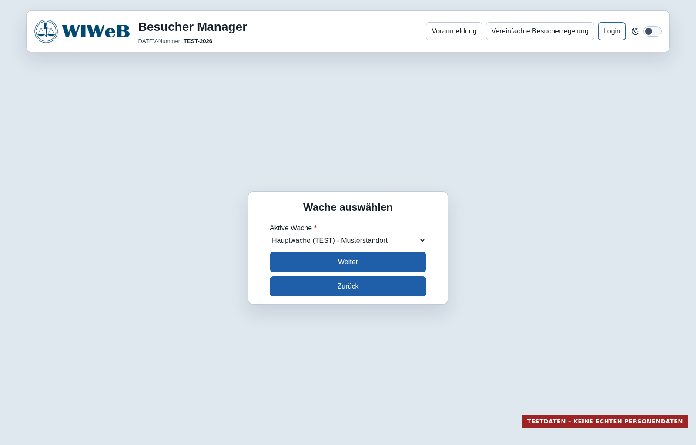
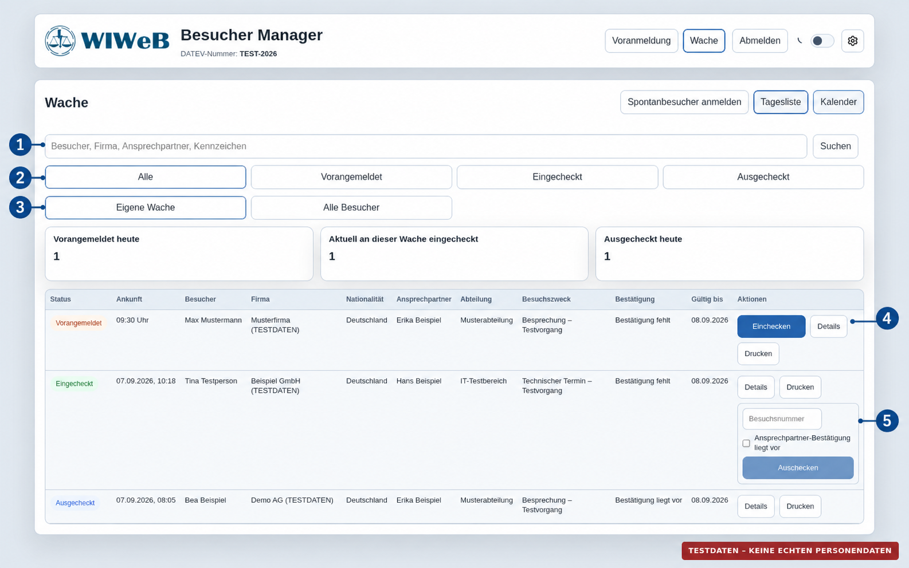
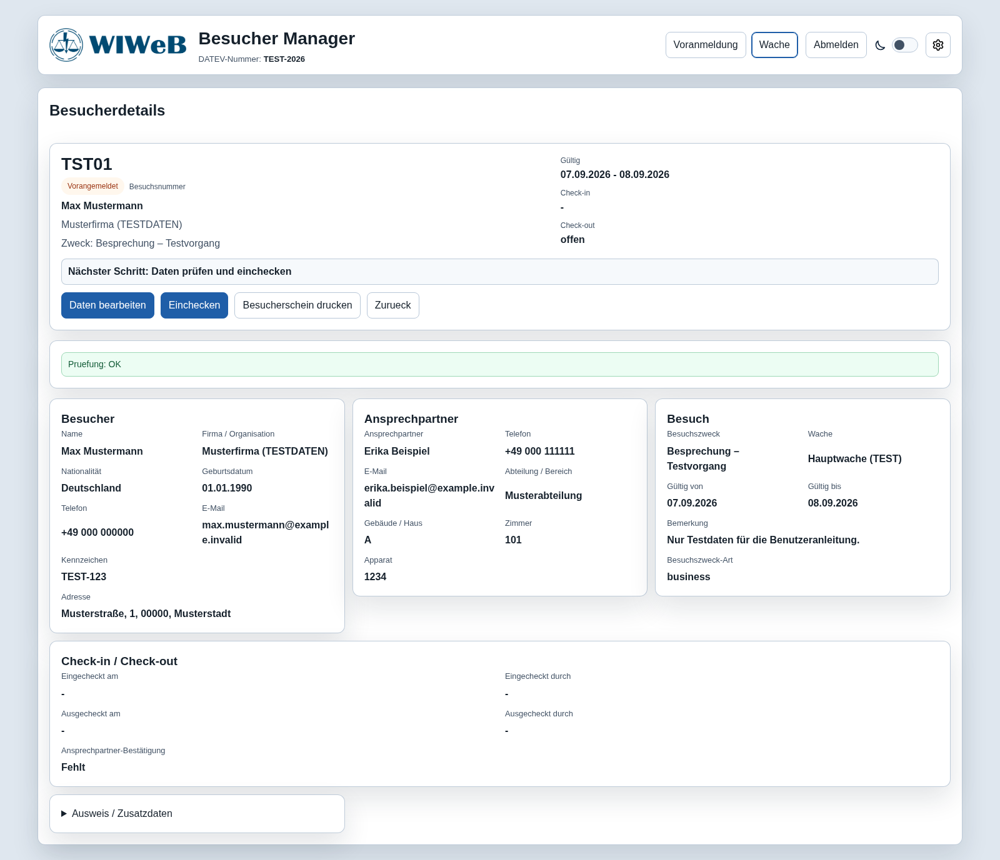
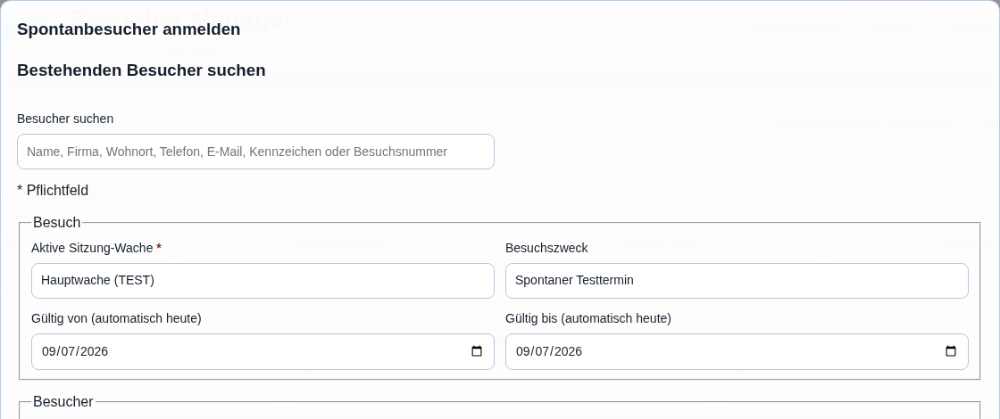
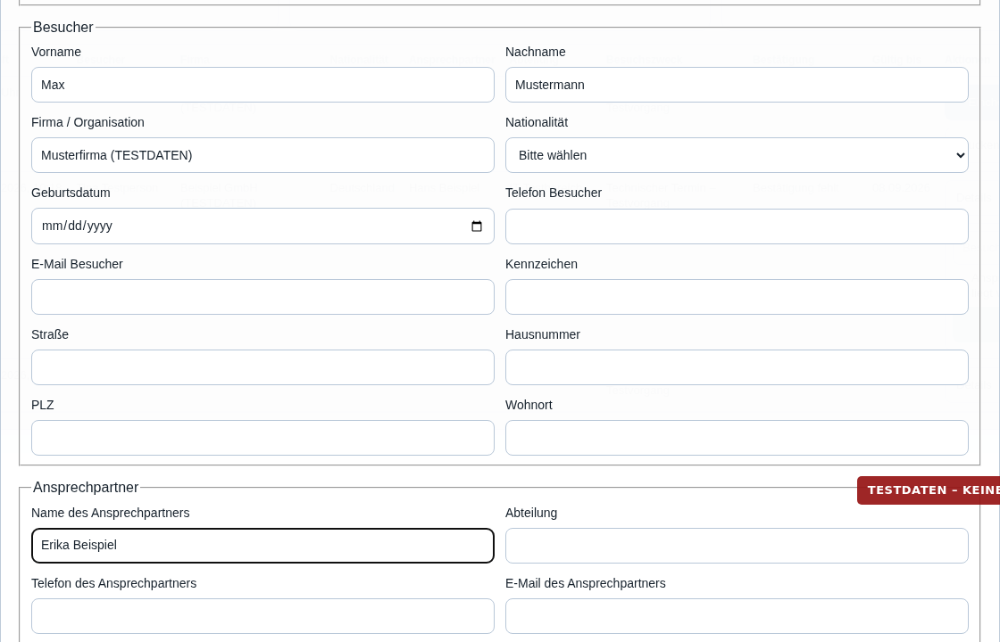
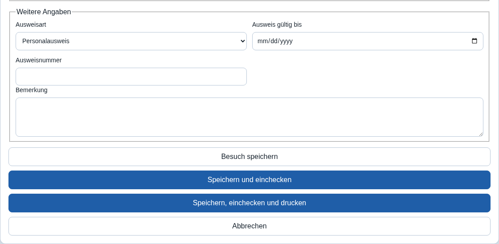
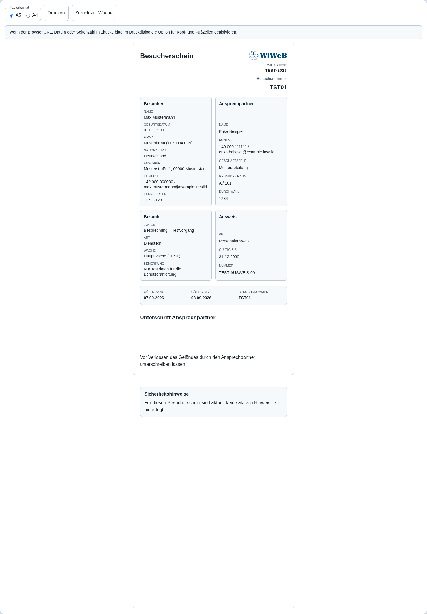
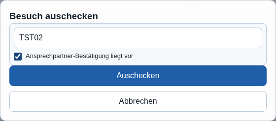

# Benutzeranleitung für die Wache

| Dokument | Stand |
|---|---|
| **Version** | 1.1 |
| **Stand** | 08.09.2026 |
| **Gültig für** | Besucher Manager 0.2.2 |
| **Geltungsbereich** | Benutzerrolle Wache |
| **Dokumentverantwortlicher** | Paul Rothenburger |

Diese Anleitung beschreibt den täglichen Ablauf an der Wache: anmelden, Besuche finden, Personen einchecken, Besucherscheine drucken, Spontanbesuche erfassen und Besuche auschecken.

> **🔒 Datenschutz**
>
> Die Screenshots enthalten ausschließlich Testdaten. Im Echtbetrieb dürfen Besucherdaten nur für den vorgesehenen dienstlichen Zweck verarbeitet und nicht außerhalb des Besucher Managers gespeichert oder weitergegeben werden.

## Schnellübersicht

**Anmelden → Finden oder erfassen → Prüfen → Einchecken → Besucherschein ausgeben → Auschecken → Abmelden**

1. Im internen Netz anmelden und die besetzte Wache auswählen.
2. Den Besuch in der Tagesliste suchen oder als Spontanbesuch anlegen.
3. Person, Besuchsdaten und Systemprüfung kontrollieren.
4. Besuch einchecken und Besucherschein ausgeben.
5. Bei Rückkehr Besuchsnummer und Ansprechpartner-Bestätigung prüfen.
6. Besuch auschecken und am Dienstende abmelden.

Für den Arbeitsplatz gibt es zusätzlich die [einseitige Kurzanleitung](kurzanleitung-wache.md).

## 1. Anmelden und Wache auswählen

**Klickpfad: Interne Adresse → Anmelden → Aktive Wache → Weiter**

| Zugang | Angabe |
|---|---|
| **Interne Adresse** | `https://besucher-docker.wiweb.svc` |
| **Benutzername** | `wache` |
| **Passwort** | Das durch den Betreiber bereitgestellte Passwort; nicht in diesem Dokument enthalten |

Die Adresse ist ausschließlich im internen Netz erreichbar.

1. Die interne Adresse im dienstlichen Browser öffnen.
2. Benutzername **wache** und das bereitgestellte Passwort eingeben.
3. **Anmelden** wählen.
4. Unter **Aktive Wache** die Wache auswählen, die aktuell besetzt wird.
5. Mit **Weiter** bestätigen.

> **⚠ Achtung**
>
> Benutzerkonto und Passwort nicht an Unbefugte weitergeben. Beim Verlassen des Arbeitsplatzes den Bildschirm sperren; nach Dienstende immer abmelden.

Wurde die falsche Wache ausgewählt: **Abmelden → erneut anmelden → richtige Wache auswählen**. Nicht unter einer falschen Wache weiterarbeiten.

## 2. Wachenübersicht verwenden

**Klickpfad: Wache → Tagesliste → Suche/Filter → Aktion**

| Markierung | Funktion |
|---|---|
| **① Suche** | Nach Besucher, Firma, Ansprechpartner oder Kennzeichen suchen |
| **② Status** | Alle, Vorangemeldet, Eingecheckt oder Ausgecheckt anzeigen |
| **③ Wachenfilter** | Eigene Wache beziehungsweise alle zulässigen Besucher anzeigen |
| **④ Aktionen** | Vorangemeldeten Besuch einchecken, Details prüfen oder drucken |
| **⑤ Check-out** | Besuchsnummer und Bestätigung erfassen, dann auschecken |

Oben rechts stehen außerdem **Spontanbesucher anmelden**, **Tagesliste** und **Kalender** zur Verfügung. Über **Kalender** kann ein anderer Besuchstag gewählt werden.

### Bedeutung der Statusanzeigen

| Status | Bedeutung | Nächster üblicher Schritt |
|---|---|---|
| **Vorangemeldet** | Besuch ist erfasst, aber noch nicht eingecheckt. | Daten prüfen und **Einchecken** wählen. |
| **Eingecheckt** | Person befindet sich auf dem Gelände. | Besucherschein ausgeben beziehungsweise bei Rückkehr auschecken. |
| **Ausgecheckt** | Besuch wurde beendet. | Keine weitere Bearbeitung erforderlich. |

## 3. Vorangemeldeten Besuch einchecken

**Klickpfad: Wache → Tagesliste → Besucher suchen → Details → Einchecken → Drucken**

### Kontrollliste vor dem Check-in

- ☐ Richtige Person und richtige Voranmeldung geöffnet
- ☐ Name, Firma und Ansprechpartner abgeglichen
- ☐ Besuchszweck, Gültigkeit und Wache geprüft
- ☐ Identität nach geltender Dienstanweisung geprüft
- ☐ Systemprüfung zeigt keine blockierenden Pflichtfelder

1. Besuch über Suche und Filter finden und **Details** öffnen.
2. Alle Angaben mit der vorliegenden Anmeldung abgleichen.
3. Hinweise unter **Prüfung** beachten; fehlende Pflichtangaben über **Daten bearbeiten** ergänzen.
4. Erst nach vollständiger Kontrolle **Einchecken** wählen und bestätigen.
5. Besucherschein drucken und vor der Ausgabe kontrollieren.

> **ℹ Hinweis**
>
> **Prüfung: OK** bedeutet nur, dass die im System konfigurierten Pflichtfelder vollständig sind. Der Hinweis ersetzt keine vorgeschriebene Identitäts- oder Berechtigungsprüfung.

Wenn **Einchecken** fehlt oder gesperrt ist: Prüfung lesen, echte fehlende Angaben ergänzen und erneut prüfen. Daten niemals raten oder erfinden.

## 4. Spontanbesucher erfassen

**Klickpfad: Wache → Spontanbesucher anmelden → vorhandenen Besucher suchen → Daten prüfen → Abschlussaktion**

### 4.1 Besuch festlegen

1. Zuerst unter **Bestehenden Besucher suchen** prüfen, ob die Person bereits gespeichert ist.
2. Richtige aktive Wache und Gültigkeitszeitraum kontrollieren.
3. Besuchszweck erfassen.

### 4.2 Besucher und Ansprechpartner erfassen

1. Besucherangaben nach den geltenden Vorgaben erfassen.
2. Ansprechpartner und Abteilung sorgfältig eintragen.
3. Keine Dublette anlegen, wenn der richtige vorhandene Besucher gefunden wurde.

### 4.3 Abschlussaktion auswählen

- **Besuch speichern**: nur erfassen, noch nicht einchecken.
- **Speichern und einchecken**: erfassen und unmittelbar einchecken.
- **Speichern, einchecken und drucken**: vollständiger Ablauf mit anschließender Druckansicht.
- **Abbrechen**: nicht gespeicherte Eingaben verwerfen.

Mit einem Sternchen gekennzeichnete Angaben sind Pflichtfelder. Zusätzlich können systemseitige Pflichtfelder für Check-in und Druck gelten.

## 5. Besucherschein drucken

**Klickpfad: Besuch → Drucken → A5/A4 → Drucken → richtigen Drucker bestätigen**

1. Beim Besuch **Drucken** oder in den Details **Besucherschein drucken** wählen.
2. Das vorgesehene Format **A5** oder **A4** auswählen.
3. **Drucken** wählen und im Browser den richtigen dienstlichen Drucker kontrollieren.
4. Browser-Kopf- und Fußzeilen im Druckdialog ausschalten.
5. Bei A4-Duplexdruck an der langen Kante wenden.
6. Ausdruck, Person und Besuchsnummer vor der Ausgabe prüfen.

> **🔒 Datenschutz**
>
> Der Besucherschein enthält personenbezogene Daten. Fehldrucke und zurückgegebene Scheine nach der örtlichen Datenschutz- und Vernichtungsregelung behandeln.

## 6. Besuch auschecken

**Klickpfad: Wache → Eingecheckt → richtigen Besuch wählen → Besuchsnummer → Bestätigung → Auschecken**

### Kontrollliste vor dem Check-out

- ☐ Richtige Person und richtiger Besuch geöffnet
- ☐ Zurückgegebenen Besucherschein geprüft
- ☐ Besuchsnummer exakt abgeglichen und eingetragen
- ☐ Ansprechpartner-Bestätigung liegt tatsächlich vor
- ☐ Erst danach **Auschecken** gewählt

> **⚠ Achtung**
>
> Die Besuchsnummer niemals aus einer anderen Zeile übernehmen. Fehlt der Besucherschein oder die Bestätigung, keine Angaben erfinden und nicht regulär auschecken. Sonderfall nach Abschnitt 7 behandeln.

## 7. Was tun, wenn …?

| Situation | Sofortmaßnahme |
|---|---|
| **Besuch nicht gefunden** | Suche verkürzen, Status **Alle**, richtiges Datum und richtige Wache prüfen. Nur bei tatsächlich fehlender Anmeldung als Spontanbesuch erfassen. |
| **Check-in oder Druck gesperrt** | **Details → Prüfung** öffnen, echte fehlende Angaben ergänzen und erneut prüfen. Fehlermeldung notieren, falls die Sperre bleibt. |
| **Falsche Person eingecheckt** | Vorgang sofort stoppen. Nicht durch einen normalen Check-out „korrigieren“ und keinen Ersatzbesuch erfinden. Wachleitung und fachlich zuständige Stelle verständigen. |
| **Versehentlich ausgecheckt** | Keine Dublette und keinen neuen Check-in als Korrektur anlegen. Wachleitung und fachlich zuständige Stelle verständigen. |
| **Falsche Wache gewählt** | Abmelden, erneut anmelden und richtige Wache auswählen. Bereits vorgenommene Buchungen der Wachleitung melden. |
| **Besucherschein verloren** | Nicht mit erfundener Besuchsnummer auschecken. Identität und Besuch nach Dienstanweisung klären und Sicherheitsstelle verständigen. |
| **Ansprechpartner nicht erreichbar** | Besucher nicht ohne erforderliche Klärung einlassen. Warten beziehungsweise Wachleitung/Sicherheitsstelle einschalten. |
| **Besucher steht an falscher Wache** | Nicht vorschnell einchecken. Zuständige Wache und Berechtigung klären; Besucher nach Dienstanweisung weiterleiten. |
| **Drucker funktioniert nicht** | Drucker, Papierformat und Ausrichtung prüfen; Druckansicht neu öffnen. Keine privaten Programme oder Geräte verwenden. |
| **Sitzung reagiert nicht** | Seite einmal neu laden; bei abgelaufener Sitzung erneut anmelden. Uhrzeit, Schritt und Fehlermeldung notieren. |
| **Kompletter Systemausfall** | Wachleitung und IT-Störungsstelle informieren. Nur den freigegebenen Papier-/Notbetrieb verwenden. Daten nachträglich nur nach Betreiberanweisung erfassen. |

## 8. Eskalations- und Meldewege

Die Kontakte sind an der Wache aktuell zu halten. Die noch offenen Angaben für Datenschutz- und Sicherheitsfälle müssen durch den Betreiber vor der fachlichen Freigabe ergänzt werden.

| Anlass | Zuständige Stelle | Kontakt |
|---|---|---|
| **Fachliche Frage oder Fehlbuchung** | Wachleitung / fachlich verantwortliche Stelle | Paul Rothenburger |
| **Technische Störung oder Systemausfall** | IT-Support | Telefon **3121** |
| **Datenschutzvorfall** | Datenschutzbeauftragte Stelle | **[Kontakt eintragen]** |
| **Sicherheitsrelevanter Sonderfall** | Zuständige Sicherheitsstelle | **[Kontakt und Alarmweg eintragen]** |

Bei einer Meldung angeben: Uhrzeit, Arbeitsplatz/Wache, betroffener Arbeitsschritt und genaue Fehlermeldung. Keine Passwörter und keine unnötigen Besucherdaten über ungeschützte Kanäle übermitteln.

## 9. Datenschutz und sichere Arbeitsweise

- Benutzerkonto und Passwort nicht an Unbefugte weitergeben.
- Nur Daten öffnen, die für die dienstliche Aufgabe benötigt werden.
- Ausweisdokumente nicht fotografieren oder privat speichern.
- Besucherdaten nicht in Messenger, private E-Mails oder freie Notizen kopieren.
- Vor Check-in, Druck und Check-out immer die aktuell geöffnete Person kontrollieren.
- Arbeitsplatz sperren, sobald er unbeaufsichtigt ist.
- Nach Dienstende über **Abmelden** aus der Anwendung abmelden.
- Verdächtige Zugriffe, falsche Zuordnungen und Datenschutzvorfälle sofort über den festgelegten Meldeweg weitergeben.

## 10. Übergabe-Checkliste

- ☐ Richtige aktive Wache ausgewählt
- ☐ Noch eingecheckte Besucher geprüft
- ☐ Offene Rückgaben und ungeklärte Check-outs übergeben
- ☐ Sonderfälle und Störungen übergeben
- ☐ Fehldrucke sicher behandelt
- ☐ Eigene Sitzung abgemeldet
